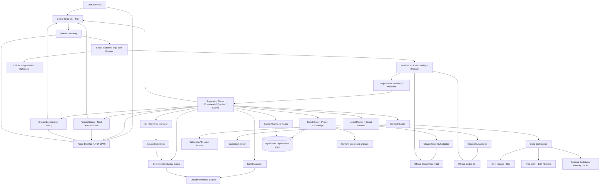
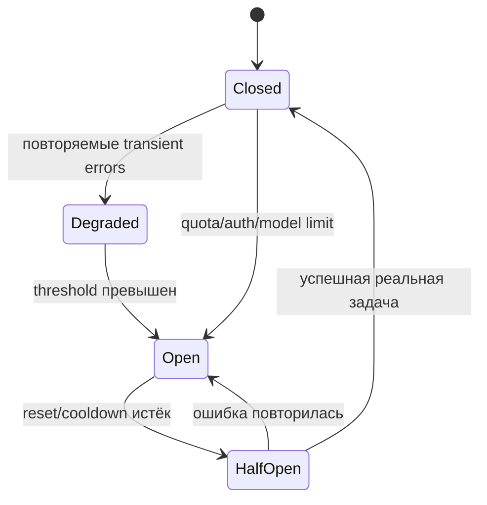

# ИИ-агентский рабочий процесс разработки ПО

## Исследование, целевая архитектура и план реализации локального control plane для Claude Code CLI и Codex CLI

**Дата актуализации:** 27 июля 2026 года
**Статус:** архитектурное предложение и технический проект
**Рабочее название системы:** `forge`

---

## Аннотация

Цель этого документа — свести в единое целое результаты исследования современных подходов к ИИ-агентской разработке ПО и предложить практически реализуемую архитектуру, которая:

- предоставляет единый интерфейс для пользователя;
- использует официальные Claude Code CLI и Codex CLI, в том числе с доступом через пользовательские подписки;
- задаёт для ролей предпочтительные модели и цепочки fallback;
- распознаёт исчерпание квоты, перегрузку, недоступность модели и другие классы ошибок;
- безопасно переключает провайдера без смешивания частичных изменений;
- хранит правила, определения агентов, навыки и workflow в одном каноническом источнике;
- выполняет работу независимыми спринтами с явными входами, границами состояния и собственным жизненным циклом;
- на первом этапе предоставляет один полный процесс реализации уровня `critical`; облегчённые варианты откладываются;
- предоставляет два полнофункциональных способа взаимодействия с единым application core: консольный CLI/TUI и .NET MAUI Desktop;
- локализует оба интерфейса: английский является языком по умолчанию и гарантированным fallback, русский поставляется из коробки, а новый язык добавляется отдельным resource catalog без изменения business logic;
- поддерживает раздельные user-scope и project-scope конфигурации: пользовательские языки UI/interaction/LLM не зависят от проекта, а языки генерируемых user-facing и agent-facing артефактов фиксируются проектом;
- после запуска показывает текущий статус проекта и активного спринта, а также предлагает наиболее подходящие доступные действия;
- ведёт пользователя по процессу: объясняет, что требует внимания, и предлагает следующие шаги и готовые команды без неявного выполнения изменяющих операций;
- устанавливается глобально в Windows и доступна как команда `forge` из корня любого проекта;
- при каждом запуске кросс-платформенный updater определяет OS/architecture, выбирает платформенную стратегию, проверяет официальный GitHub Releases Forge и самообновляется при наличии новой версии; в MVP реализована только Windows-стратегия;
- при первом запуске в проекте подтверждает корневой каталог и создаёт каноническую конфигурацию в `.forge/`;
- при каждом запуске проверяет наличие и версии Claude Code CLI и Codex CLI, при необходимости обновляет их и повторяет проверку;
- минимизирует расход контекста и не привязывает память к чату конкретной модели;
- оптимально получает контекст из кодовой базы;
- использует детерминированную логику для orchestration, состояния, проверок и Git-операций, оставляя LLM только задачи, где требуется содержательное суждение.

Главный вывод:

> Claude и Codex должны быть заменяемыми исполнителями ограниченных узлов, а не владельцами workflow, памяти, состояния проекта или пользовательского интерфейса.

Поэтому рекомендуется не выбирать один существующий фреймворк целиком, а построить на C#/.NET Core небольшой локальный control plane — `forge` — над официальными CLI. Он предоставляет два равноправных полнофункциональных presentation surface: `forge` CLI/TUI и .NET MAUI Desktop, работающие через один bootstrap, application core, project state и localization catalog; английский используется по умолчанию, русский встроен в поставку. Updater проектируется кросс-платформенным и внутри выбирает OS-specific strategy, хотя MVP поставляет только Windows installer и `WindowsUpdateStrategy`. В MVP Forge глобально устанавливается в Windows, при запуске самообновляется из официального GitHub Releases, инициализирует проект в `.forge/`, приводит Claude Code CLI и Codex CLI к актуальным версиям, а затем выполняет декларативный граф работ в границах независимых спринтов, собирает минимальный контекст, нормализует результаты и ошибки, управляет Git worktree, сохраняет состояние в SQLite и применяет формальные критерии завершения.

---

## 1. Исходные требования и критерии успеха

### 1.1. Функциональные требования

| Требование | Предлагаемое решение |
|---|---|
| Два полнофункциональных интерфейса | Консольный `forge` CLI/TUI и .NET MAUI Desktop используют один application core и имеют функциональный паритет |
| Локализация | Общий localization catalog для CLI/TUI и MAUI; default/fallback `en`, встроенный `ru`, добавление языка через отдельный resource pack |
| Два scope конфигурации | User-scope хранит UI/interaction/LLM language и другие персональные настройки; project-scope внутри `.forge/` хранит воспроизводимые настройки проекта |
| Языки артефактов | Project-scope отдельно задаёт язык генерируемых user-facing и agent-facing артефактов; machine artifacts остаются invariant |
| Статус при запуске | После bootstrap Forge строит единый project/sprint status snapshot и отображает его в CLI/TUI или MAUI |
| Ведение пользователя | Детерминированный Next Action Advisor ранжирует допустимые следующие действия, объясняет причины и предоставляет готовую команду или UI action |
| Claude и Codex по подписке | Запуск официальных локальных CLI, уже авторизованных пользователем |
| Preferred и fallback-модели | Логические model policies, разрешаемые в текущие модели и профили |
| Переключение после исчерпания лимита | Нормализатор ошибок, circuit breaker, cooldown и cross-provider routing |
| Глобальная установка | Windows PowerShell installer устанавливает `forge.exe` для текущего пользователя и добавляет каталог в пользовательский `PATH` |
| Самообновление Forge | Кросс-платформенное ядро определяет OS/architecture и делегирует latest-release install/activate/restart платформенной стратегии; MVP реализует Windows |
| Запуск из корня проекта | Bare-команда `forge` проверяет `.forge/`; при отсутствии подтверждает корень и запускает инициализацию |
| Единая система правил и агентов | Канонический каталог `.forge/` в корне проекта и генераторы нативных представлений |
| Актуальные provider CLI | Startup preflight проверяет доступность и версии `codex`/`claude`, обновляет устаревшие установки и выполняет повторную проверку |
| Независимые итерации | Спринт как верхнеуровневая единица: собственные входы, `base SHA`, ветка, состояние и артефакты |
| Единый процесс реализации в MVP | Только полный workflow `critical`; облегчённые процессы не входят в первый релиз |
| Общая экономная память | Specs, ADR, structured handoffs, SQLite sprint state, content-addressed artifacts |
| Работа с кодовой базой | Git/ripgrep → AST → LSP → graph/SCIP → точечное чтение |
| Максимум детерминизма | Workflow, retries, Git, merge, gates, валидация и учёт выполняются кодом |

### 1.2. Нефункциональные требования

Система должна обеспечивать:

- возобновление после аварийного завершения процесса;
- воспроизводимость решения хотя бы на уровне входных артефактов, версий CLI, base SHA и model policy;
- безопасную изоляцию write-узлов;
- независимый запуск, возобновление, завершение и отмену каждого спринта без неявной зависимости от состояния других незавершённых спринтов;
- возможность параллельного существования нескольких спринтов при раздельных write scopes и worktree;
- глобальную per-user установку на Windows без требования административных прав;
- fail-safe самообновление Forge до работы с project state: checksum/signature verification, atomic activation, restart и rollback;
- отсутствие Windows-specific filesystem/process/path logic в общем self-update state machine;
- один surface-neutral набор commands/queries/events для CLI/TUI и .NET MAUI Desktop;
- функциональный паритет двух UI: инициализация, sprint lifecycle, workflow execution, diagnostics, approvals, findings, gates, sync, validate и eval;
- единый localization layer для обоих UI, полный English catalog и встроенный Russian catalog;
- устойчивый fallback на английский для отсутствующего culture/key и проверяемая полнота каждого поставляемого language pack;
- culture-neutral commands, schema/property names, diagnostic/event codes и persisted state;
- schema-validated user/project configuration с явной принадлежностью каждого key ровно одному scope;
- запрет project-scope переопределять персональные языки UI/interaction/LLM и запрет user-scope менять языки проектных артефактов;
- воспроизводимую классификацию каждого генератора артефактов как `user_facing`, `agent_facing` или `machine`;
- единый, воспроизводимый project/sprint status snapshot и одинаковые рекомендации в обоих UI;
- объяснимость рекомендаций: причина, предусловия, ожидаемый результат и safety/permission classification;
- отсутствие автоматического запуска mutating/destructive suggested actions без обычного подтверждения и permission policy;
- отсутствие orchestration, provider, Git или persistence logic в presentation projects;
- идемпотентную инициализацию проекта: существующая `.forge/` не перезаписывается без явного действия;
- отсутствие project-scope forge-конфигурации вне `.forge/`; user-scope хранится только в стандартном пользовательском config directory, а provider-native generated files считаются производными;
- блокировку запуска рабочего процесса, если после update/recheck обязательный Claude Code CLI или Codex CLI недоступен;
- наблюдаемость: события, длительности, попытки, используемые модели, тесты, причины fallback;
- ограничение затрат: context budget, max turns, max iterations, concurrency caps;
- защиту от prompt injection из репозитория и сторонних MCP-серверов;
- работу без необязательного графового индекса;
- возможность постепенно заменить локальный runtime распределённым, не меняя формат workflow.

### 1.3. Критерий архитектурного успеха

Архитектура считается удачной, если:

1. пользователь запускает один и тот же workflow независимо от доступности Claude или Codex;
2. переключение модели не требует передачи полного transcript;
3. write-попытка другой модели начинается от контролируемого чистого состояния;
4. система может объяснить, почему выбран конкретный провайдер;
5. завершение определяется проверяемыми условиями, а не фразой модели «готово»;
6. правила не нужно вручную синхронизировать между `CLAUDE.md`, `AGENTS.md` и профилями;
7. выключение любого необязательного слоя памяти не нарушает корректность;
8. любой спринт воспроизводится по собственным входам, `base SHA` и версиям workflow/policy, не читая изменяемое состояние другого спринта;
9. остановка, ошибка или отмена одного спринта не меняет состояние остальных;
10. после установки новая консоль Windows находит `forge` через пользовательский `PATH`;
11. updater детерминированно определяет OS/architecture и выбирает зарегистрированную `IPlatformUpdateStrategy`, не размазывая платформенные условия по общему алгоритму;
12. на Windows при наличии более новой stable-версии в официальном GitHub Releases Forge обновляется до неё и продолжает исходную команду уже новым executable;
13. сбой самообновления не повреждает активную версию и не допускает project/sprint-команды;
14. неподдерживаемая в текущем релизе OS завершается явным `platform_not_supported` до файловых изменений;
15. CLI/TUI и .NET MAUI Desktop предоставляют один и тот же публичный capability set и одинаково применяют permissions/human gates;
16. действие, запущенное в одном UI, немедленно отражается во втором через общее durable state/event stream;
17. первый запуск из подтверждённого корня создаёт валидную `.forge/`, а повторный запуск использует её без повторной инициализации;
18. перед выполнением project-команды обе provider CLI доступны, их локальные и последние известные версии зафиксированы, а результат обновления повторно проверен;
19. после запуска пользователь видит актуальное состояние проекта и выбранного либо требующего внимания спринта;
20. для каждого предлагаемого следующего действия система показывает основание и выполняет его только через обычный application command с теми же permissions, confirmations и idempotency rules;
21. чистая установка использует английский, пользователь может выбрать русский в CLI/TUI или MAUI, а оба surfaces применяют одну culture и одинаковые переводы;
22. добавление нового языка требует нового catalog/resource pack и переводов, но не изменений Domain/Application или workflow schemas;
23. смена проекта не меняет user-scope языки UI, interaction и LLM communication;
24. два пользователя одного проекта могут общаться с Forge/LLM на разных языках, но генерируют project artifacts на одинаковых зафиксированных project-scope языках;
25. user-facing и agent-facing generators берут язык из разных project keys, а machine artifacts не зависят от culture.

---

## 2. Итоги исследования рассмотренных подходов

### 2.1. Agentic Software Development (ASD)

Репозиторий [LordKuper/agentic-software-development](#S1) описывает Claude Code-native процесс из девяти обязательных фаз:

```text
scope → audit → design → design-review → design-promote
      → plan → impl → impl-review → PR
```

Полезные идеи:

- фиксированный жизненный цикл спринта;
- долговечные проектные и спринтовые артефакты;
- независимые review-проходы с чистым контекстом;
- severity floor и ограничение review-loop;
- coverage ledger, не позволяющий reviewer молча пропустить файл или правило;
- трассировка задач к acceptance criteria;
- отдельные правила для design и implementation;
- Codex CLI как внешний reviewer;
- состояние спринта вне беседы модели.

Ограничения для поставленной задачи:

- Claude Code остаётся главным интерфейсом и верхнеуровневым оркестратором;
- Codex преимущественно играет роль внешнего reviewer;
- обязательный девятифазный процесс слишком дорог для простых изменений;
- одна активная ветка/спринт ограничивает параллелизм;
- fallback между подписками не является независимым control plane;
- определения ориентированы на нативные сущности Claude Code.

Решение: взять lifecycle, артефакты, review convergence, coverage ledger и severity, но исполнять их внешним детерминированным workflow engine. В MVP реализовать только наиболее полный вариант процесса — `critical`. Облегчённые workflow с сокращённым числом фаз можно добавить позднее, не меняя контракт спринта и типы узлов.

### 2.2. Graph Engineering из публикации 0xCodez

Исходная публикация: [0xCodez в X](#S2).

Из неё полезна архитектурная эвристика:

- **узел** выполняет ограниченную содержательную работу;
- **ребро** только передаёт, фильтрует или преобразует данные;
- flatten, filter, deduplicate, sort, route, merge и retry не требуют LLM;
- независимые узлы должны иметь возможность выполняться параллельно;
- fan-in нужен только там, где потребителю требуется общий набор результатов;
- циклы обязаны иметь формальный предел и условие сходимости.

Публикация в социальной сети не является нормативной документацией продукта. На дату подготовки документа публичный интерфейс X не отдавал текст сообщения исследовательскому инструменту, поэтому ссылка сохранена как исходный источник идеи, но конкретные продуктовые утверждения из неё не используются как доказанные факты.

Практический вывод:

> Модель может предложить граф, но валидировать, сохранять и выполнять граф должен обычный программный runtime.

### 2.3. Docker Agent

[Docker Agent](#S3) — наиболее близкий из рассмотренных проектов к декларативной multi-agent системе:

- YAML-конфигурация;
- разные модельные провайдеры;
- multi-agent orchestration;
- MCP;
- RAG с BM25, embeddings, hybrid search и reranking;
- SQLite-сессии;
- упаковка и доставка агентов через OCI;
- fallback-модели, retries и cooldown.

Документация Docker рекомендует цепочку fallback через разных провайдеров, retries для серверных ошибок и период «прилипания» к fallback после rate limit [S4]. Актуальная документация также описывает API keys, Docker Model Runner и некоторые account-based варианты входа [S5].

Почему не следует сразу делать Docker Agent основным runtime:

- требование связано именно с официальными Claude Code CLI и Codex CLI и их нативными подписочными поверхностями;
- provider abstraction Docker Agent не равен запуску двух полноценных coding harness со своими sandbox, hooks, skills, worktrees и форматами событий;
- безопасный replay частично изменившего код узла требует контроля на уровне Git и попыток;
- нужен единый компилятор SSoT в нативные форматы обоих CLI.

Что стоит заимствовать:

- декларативную конфигурацию;
- fallback/cooldown semantics;
- OCI-пакеты для распространяемых наборов агентов;
- команду диагностики окружения;
- идею конфигурируемой RAG-цепочки.

Docker Agent нужно повторно оценить как runtime, если организация перейдёт на API-ключи или если его CLI-provider layer начнёт безопасно исполнять необходимые официальные harness без потери их гарантий.

### 2.4. Codebase Memory MCP

[Codebase Memory MCP](#S6) строит локальный граф кода с помощью Tree-sitter и гибридного LSP-разрешения. Он предоставляет структурные запросы по функциям, классам, вызовам, маршрутам и межсервисным связям.

Сильные стороны:

- локальная обработка;
- быстрый перестраиваемый индекс;
- структурный обзор и impact analysis;
- единый MCP-сервер для разных клиентов;
- компактные ответы вместо чтения множества файлов.

В README и связанном preprint [S7] приведена оценка на 31 репозитории: 83% качества ответа, примерно в десять раз меньше токенов и в 2,1 раза меньше tool calls по сравнению с file-by-file exploration. Эти цифры следует считать результатами авторов проекта и проверять собственным benchmark; они не доказывают превосходство для конкретного стека.

Вывод:

> Codebase Memory — ускоряющий и полностью перестраиваемый индекс, но не источник истины.

Любое критичное утверждение из графа должно подтверждаться актуальными файлами, Git SHA и при необходимости LSP/компилятором.

### 2.5. GitHub Spec Kit

[GitHub Spec Kit](#S8) формализует Spec-Driven Development:

```text
constitution → specify → plan → tasks → implement
```

Полезные идеи:

- constitution проекта;
- явное разделение «что и зачем» от «как»;
- спецификация, план, задачи и реализация как отдельные артефакты;
- consistency analysis;
- checklist как тесты для требований;
- расширения, presets, workflows и versioned bundles;
- порядок разрешения project override → preset → extension → core [S9];
- bundles как воспроизводимая поставка полного рабочего набора [S10];
- декомпозиция очень больших функций на независимые спецификации [S11].

Ограничения:

- документы могут становиться многословными;
- переходы часто поручаются LLM;
- полный spec-cycle избыточен для тривиальных изменений;
- наличие спецификации ещё не гарантирует runtime traceability и безопасный fallback.

Решение: использовать Spec Kit как основу форматов продуктовых артефактов, но не как durable orchestration engine.

### 2.6. wshobson/agents

[wshobson/agents](#S12) демонстрирует важный шаблон поставки:

- единый Markdown source of truth;
- генерация нативных артефактов для разных harness;
- progressive disclosure;
- в контекст загружаются компоненты установленного плагина, а не весь каталог;
- статические, LLM-judge и Monte Carlo проверки навыков [S13].

На момент исследования каталог очень велик: сотни агентов и навыков. Масштаб полезен как библиотека, но опасен как стартовая конфигурация проекта: возрастают неоднозначность выбора, конфликт правил и стоимость discovery.

Решение: заимствовать compiler/adapters, progressive disclosure и eval-подход, но начать с 6–8 ролей и ограниченного набора навыков.

### 2.7. Альтернативы и дополнения

#### Serena

[Serena](#S14) предоставляет symbol-level retrieval, references, semantic editing и refactoring поверх language servers через MCP. Это сильная база для точной навигации и изменений, особенно в крупных типизированных проектах.

Рекомендуемая роль: основной необязательный semantic code tool; текстовые инструменты и прямое чтение файлов остаются fallback.

#### SCIP

[SCIP](#S15) — language-agnostic протокол индексации определений, ссылок и реализаций. Он особенно полезен в больших mono/polyrepo и для cross-repository навигации, где одноразовый локальный LSP не даёт достаточного покрытия.

#### Tree-sitter и LSP

[Tree-sitter](#S16) даёт быстрый инкрементальный синтаксический анализ и способен возвращать полезное дерево даже при синтаксических ошибках. [Language Server Protocol](#S17) предоставляет семантические определения, references, diagnostics и операции refactoring.

Оптимальная комбинация:

```text
обязательно: Git + ripgrep + targeted reads
по умолчанию: Tree-sitter + LSP
рекомендуемо: Serena
опционально: Codebase Memory
для масштаба организации: SCIP
```

---

## 3. Ключевые архитектурные принципы

### 3.1. LLM отвечает за judgment

LLM следует использовать для:

- выявления содержательной неоднозначности требований;
- архитектурных альтернатив и trade-offs;
- семантической декомпозиции;
- написания нетривиального кода;
- гипотез root cause;
- семантического review;
- объяснения конфликта требований или reviewers.

### 3.2. Код отвечает за механику

Детерминированно выполняются:

- переходы workflow;
- dependency graph;
- fan-out/fan-in;
- retries, timeout и cooldown;
- model routing;
- Git/worktree/branch;
- formatter, lint, build и tests;
- JSON Schema validation;
- дедупликация findings;
- проверка traceability IDs;
- permission enforcement;
- подсчёт бюджета и state transitions.

### 3.3. Состояние не живёт в transcript

Transcript конкретного CLI:

- трудно переносить между моделями;
- дорого повторно отправлять;
- неудобно валидировать;
- может включать скрытую или провайдер-специфичную информацию;
- не является надёжным event log.

Состояние workflow хранится в SQLite и артефактах. Между узлами передаются структурированные handoff, а не полная история.

### 3.4. Индексы — производные данные

Источником истины остаются:

- Git commit;
- файлы;
- спецификации и ADR под версионным контролем;
- результаты реальных команд проверки.

AST, LSP cache, graph и embeddings можно удалить и перестроить.

### 3.5. Изоляция write-попыток

Каждый write-узел и каждая повторная попытка должны работать в отдельном Git worktree от фиксированного base SHA. Это делает fallback проверяемым и предотвращает продолжение поверх неизвестного частичного состояния.

### 3.6. Progressive disclosure

В prompt включается только:

- минимальное глобальное ядро правил;
- правила затронутых путей;
- текущий спринт и его bounded tasks;
- нужные acceptance criteria;
- релевантные ADR;
- точечные символы и фрагменты кода;
- structured handoff предыдущего узла.

---

## 4. Целевая архитектура



### 4.1. Компоненты

#### Interaction surfaces и функциональный паритет

CLI/TUI и .NET MAUI Desktop — два равноправных presentation adapter над одним набором application commands, queries и events. Они не вызывают provider CLI, Git, SQLite или updater напрямую. Любая функция считается публично реализованной только после появления в обоих surfaces либо после явной классификации как internal/automation-only.

Обязательный общий capability set:

- выбор или подтверждение project root и инициализация `.forge/`;
- создание, запуск, просмотр, возобновление, отмена и rebase спринта;
- отображение DAG, nodes, attempts, worktree и route decisions;
- просмотр gates, findings, handoff и artifacts;
- human approval и recovery actions;
- model/provider health, startup diagnostics и update status;
- `sync`, `validate`, drift checks и evals;
- просмотр истории событий, безопасных logs и метрик;
- раздельное управление user/project config, языками UI/interaction/LLM и языками user-facing/agent-facing artifacts;
- startup status snapshot и объяснимые suggested next actions.

##### `forge` CLI/TUI

Консольная точка входа:

```powershell
PS C:\src\game> forge

forge sprint create --title "Добавить авторизацию через Steam"
forge sprint list
forge sprint run <sprint-id>
forge sprint status <sprint-id>
forge sprint inspect <sprint-id> implementation.backend
forge sprint resume <sprint-id>
forge sprint rebase <sprint-id> --onto <commit>
forge sprint cancel <sprint-id>
forge status
forge next
forge config user set language.ui ru
forge config user set language.interaction ru
forge config user set language.llm ru
forge config project set artifacts.language.user_facing ru
forge config project set artifacts.language.agent_facing en
forge config show --effective --provenance
forge models
forge doctor
forge sync
forge validate
forge eval
```

Bare-команда `forge` предназначена для запуска из текущего корня проекта. Она проходит обязательный startup pipeline:

```text
resolve global executable
→ load/migrate user-scope config and resolve UI/interaction/LLM languages
→ detect OS and architecture
→ select platform update strategy
→ acquire platform update lock
→ compare local Forge version with latest stable GitHub Release
→ download, verify, stage and activate newer Forge when available
→ restart the original command with the same cwd and arguments
→ inspect codex/claude availability and local versions
→ resolve latest versions from approved distribution channels
→ install/update missing or outdated provider CLI
→ refresh executable discovery and recheck both CLI
→ verify current directory as project root
→ load .forge/manifest.yaml or confirm initialization
→ validate project-scope configuration and artifact language capabilities
→ validate/sync project configuration
→ build project and sprint status snapshot
→ rank safe next actions and attach rationale
→ open requested CLI/TUI or Desktop surface
```

Если `.forge/manifest.yaml` отсутствует, интерактивный запуск задаёт явный вопрос: «Текущий каталог `<absolute-path>` точно является корнем проекта?». Ответ `yes` запускает идемпотентную первичную инициализацию; ответ `no` завершает процесс без изменений. Forge не поднимается молча к родительскому каталогу и не угадывает корень, чтобы случайно не создать конфигурацию не в том репозитории.

Для automation предусмотрена явная форма `forge init --project-root <absolute-path> --yes`. Без `--yes` и интерактивного терминала отсутствие `.forge/` является ошибкой. Если `.forge/` существует, но manifest отсутствует или невалиден, автоматическая переинициализация запрещена: пользователь получает диагностику и команду восстановления.

Forge self-update и toolchain preflight выполняются при запуске обоих surfaces. Self-updater всегда начинает с определения OS/architecture и platform strategy. В MVP зарегистрирована только Windows-стратегия; обнаружение Linux/macOS приводит к `platform_not_supported` без попытки применить Windows-команды. Глобальные CLI-команды `forge --version` и `forge doctor --startup` после startup checks не требуют project root и никогда не создают `.forge/`; Desktop до выбора проекта показывает глобальный startup/toolchain status. Bare-запуск, sprint-команды, `sync`, `validate`, Desktop project open и остальные project actions переходят к root verification и initialization. Внутренний installer self-test — единственная точка входа, которая не запускает сетевое самообновление.

После успешного project bootstrap bare-команда не оставляет пользователя на пустом prompt. Она выводит:

- project root, состояние `.forge/`, Git branch/dirty summary и доступность provider toolchain;
- число спринтов по состояниям и список спринтов, требующих внимания;
- статус выбранного активного спринта: workflow, node/gate, progress, blockers, findings и ожидаемый human action;
- 1–5 ранжированных следующих действий с краткой причиной и готовой командой.

Для automation доступны `forge status --json` и `forge next --json` со stable versioned schema. Интерактивные пояснения не примешиваются к machine-readable stdout; после явной команды follow-up guidance показывается только в interactive surface либо возвращается отдельным структурированным полем.

Если bootstrap завершается раньше загрузки проекта, Forge всё равно показывает ограниченный startup/recovery snapshot: какой шаг не прошёл, какие версии и checks известны, что безопасно повторить и какую diagnostic/recovery command запустить. Такая рекомендация не маскирует исходную ошибку и не разрешает project/sprint work в обход fail-closed policy.

Активным считается спринт, явно выбранный пользователем в текущем surface, либо единственный non-terminal sprint. Если non-terminal спринтов несколько и явного выбора нет, Forge не назначает один молча: показывает project overview, сначала выделяет состояния `awaiting_human`, `blocked` и `failed`, затем предлагает выбрать, просмотреть или продолжить конкретный спринт. Если спринтов нет, основная рекомендация — создать первый `implementation-critical` sprint.

TUI показывает:

- выбранный спринт, его `base SHA`, ветку и версию workflow;
- граф и статусы узлов;
- активную модель и capability policy;
- worktree каждой write-попытки;
- результаты gates;
- открытые findings;
- события fallback и cooldown;
- контекстный бюджет;
- ожидаемые human gates;
- блок «Что делать дальше» с numbered actions, rationale и готовыми командами.

##### .NET MAUI Desktop

Desktop-приложение устанавливается вместе с CLI и запускается отдельным executable/ярлыком. Поскольку у GUI-запуска нет надёжного current working directory проекта, пользователь выбирает project root через native folder picker или список recent projects. Выбранный абсолютный путь проходит тот же `Project Root Resolver / Initializer`, что и CLI; отсутствие `.forge/` требует такого же явного подтверждения и использует тот же atomic init.

Desktop предоставляет:

- project switcher и recent projects;
- dashboard активных и завершённых спринтов;
- интерактивный DAG с node/attempt details;
- live event stream, gates, findings и artifacts;
- формы создания/запуска/rebase/cancel спринта;
- approvals и recovery actions;
- provider/toolchain/self-update diagnostics;
- экраны configuration validation, sync, drift и evals;
- безопасное открытие diff/log/artifact без выполнения содержимого;
- стартовый project/sprint status dashboard и блок recommended actions с переходом к соответствующему экрану или confirmation.

Закрытие окна не отменяет durable sprint. Desktop повторно подключается к общему state/event stream и восстанавливает UI из SQLite/CAS, а не из памяти окна.

##### Контракт паритета

Capability matrix хранится как versioned test fixture. Для каждой публичной capability фиксируются application command/query, CLI/TUI entrypoint, MAUI view/action, permission policy и acceptance test. Общая presentation-модель использует immutable DTO и typed events; UI-specific state не становится источником истины.

Оба surfaces могут быть открыты одновременно. Изменяющие операции используют общие idempotency/concurrency contracts, а обновления состояния доставляются обоим UI. Human gate, permission prompt и destructive confirmation имеют одинаковую семантику независимо от surface.

##### User-scope и project-scope configuration

Forge поддерживает два schema-validated scope с непересекающимися key spaces:

| Scope | Каноническое расположение в MVP | Назначение |
|---|---|---|
| `user` | `%LOCALAPPDATA%\Forge\config.yaml` | Персональное поведение UI/TUI, interaction и общения с LLM; recent projects и другие некомандные preferences |
| `project` | `<project-root>/.forge/manifest.yaml` и referenced files только под `.forge/` | Общие воспроизводимые настройки проекта, workflow, policies и языки генерируемых артефактов |

Project-scope может быть tracked в Git и применяется одинаково для всех пользователей проекта. User-scope никогда не копируется в `.forge/`. Presentation-only keys `language.ui` и `language.interaction` не входят в hashes workflow inputs. Effective `language.llm` является явным исключением: когда оно влияет на provider prompt, значение фиксируется в attempt context manifest и input hash для воспроизводимости, но не определяет язык project artifact. Credentials и provider tokens не относятся ни к одному YAML scope и остаются в provider-managed authentication/OS secret storage.

Каждый configuration key зарегистрирован с owner scope, schema, default, sensitivity и restart policy. Ключ из неправильного scope отклоняется как `configuration_scope_violation`; неявного merge одноимённых user/project keys нет. `forge config show --effective --provenance` и соответствующий MAUI screen показывают effective value, default и точный источник каждого значения без раскрытия secrets.

Session override допускается только для user-scope presentation/interaction settings и имеет порядок `explicit CLI option → user config → built-in default`. Project artifact policy изменяется только явной project command/MAUI action, проходит validation и записывается атомарно в `.forge/`. User config также обновляется атомарно и мигрируется независимо от project manifest.

##### Локализация

CLI/TUI и MAUI используют один `ILocalizationCatalog`; presentation projects не хранят собственные независимые переводы. MVP включает полный English catalog (`en`) и Russian catalog (`ru`). Английский является default и ultimate fallback: Forge не выбирает язык ОС автоматически на чистой установке.

User-scope содержит три независимых, наследуемых значения:

- `language.ui`: labels, menus, help и layout resources; default `en`;
- `language.interaction`: prompts, status, guidance, approvals и diagnostics; default наследуется от `language.ui`;
- `language.llm`: язык естественно-языкового общения Forge/LLM с пользователем, включая clarification questions и ответы; default наследуется от `language.interaction`.

Все language values используют нормализованные BCP 47 tags (`en`, `ru`, позднее `pt-BR` и т. п.).

Session options `--ui-language`, `--interaction-language` и `--llm-language` переопределяют соответствующее значение только для текущего запуска. Project-scope не может переопределить эти ключи. Смена user language применяется к следующему CLI render и немедленно обновляет открытый TUI/MAUI surface без изменения workflow state.

Project-scope отдельно задаёт:

```yaml
artifacts:
  language:
    user_facing: ru
    agent_facing: en
```

Каждый artifact generator обязан объявить audience:

- `user_facing`: release notes, end-user/project documentation, human reports и другие результаты для людей;
- `agent_facing`: specs, plans, tasks, handoffs, findings, context summaries и другие входы/выходы агентского процесса;
- `machine`: JSON/YAML contracts, identifiers, hashes, event/state records — язык не применяется.

Артефакт с неясной аудиторией не генерируется до исправления registry/schema; implicit `mixed` fallback запрещён. Если нужны две аудитории, generator создаёт два явно типизированных представления. Язык артефакта определяется project snapshot и фиксируется в artifact metadata, поэтому смена user-scope языка не меняет содержимое проекта. Изменение project artifact language влияет только на новые или явно regenerated artifacts.

При вызове LLM Forge передаёт раздельные поля `conversation_language` из user-scope и `artifact_output_language` из project-scope плюс declared artifact audience. Модель может объяснять действие пользователю по-русски и одновременно создавать agent-facing spec по-английски. Schema-constrained machine output не получает language instruction. Provider adapter не смешивает эти значения в одно поле.

Локализуются меню, TUI/MAUI labels, help, prompts, validation/diagnostic messages, status summaries, suggested-action titles/rationale и installer-facing тексты. Не переводятся command names/flags, YAML/JSON property names, identifiers, exit codes, diagnostic/event codes, telemetry attributes, Git/provider raw output и persisted domain state. Events и findings сохраняют `message_key` с typed arguments; строка формируется только в presentation layer. Machine-readable output возвращает стабильные codes/keys/arguments независимо от culture.

`install.ps1` использует English по умолчанию и принимает явный `-Language en|ru`; выбранное значение инициализирует `language.ui`, `language.interaction` и `language.llm` в user-scope config.

Новый язык добавляется отдельным catalog/resource pack с culture manifest и capability flags для `ui`, `interaction`, `llm`, `artifact_user_facing` и `artifact_agent_facing`. Domain, Application, workflow definitions и schemas не изменяются. Catalog поддерживает named parameters, plural/select rules, artifact templates/terminology и culture-aware date/number formatting; конкатенация локализованных фрагментов запрещена. Для UI/interaction при отсутствии culture или отдельного key выполняется fallback на `en`, регистрируется безопасная metric/event и UI продолжает работу. Для project artifact language отсутствие требуемой pack capability является validation error: Forge не создаёт артефакт молча на другом языке.

CI проверяет:

- полное совпадение обязательных keys с English catalog;
- корректность placeholders и plural/select variants;
- отсутствие hard-coded user-facing strings в CLI/TUI и MAUI;
- pseudo-localization для расширения строк и поиска layout defects;
- одинаковую culture и localization key semantics в обоих surfaces;
- раздельную генерацию user-facing и agent-facing fixture artifacts;
- отсутствие зависимости project artifacts от user-scope languages.

##### Project Status и Next Action Advisor

`ProjectStatusQuery` строит immutable snapshot только из канонического project/sprint state, Git/provider diagnostics и результатов validation. `NextActionAdvisor` применяет versioned deterministic rules к этому snapshot и возвращает упорядоченный список `SuggestedAction`:

```text
action_id
title
rationale
target project/sprint/node
preconditions
command preview / MAUI navigation target
safety class and required permission
priority
snapshot version / expected state version
```

Базовый порядок рекомендаций: устранить startup/configuration failure → ответить на human gate → разобрать failed/blocked sprint → продолжить resumable sprint → проверить готовый к финализации sprint → начать или создать следующий sprint. Внутри одного класса порядок стабилен и объясним.

Advisor не является автономным агентом и не выполняет рекомендации сам. Выбор рекомендации диспатчит обычный application command, который повторно проверяет preconditions, optimistic concurrency, permission policy и confirmation. Устаревшая рекомендация отклоняется как `suggestion_stale`, после чего snapshot и список действий перестраиваются. LLM может позже улучшать формулировку объяснения, но не определяет допустимость, порядок безопасности или сам command.

Snapshot и recommendations перестраиваются после каждого state-changing command и значимого domain event. Поэтому ведение пользователя продолжается не только на стартовом экране: после завершения шага, появления finding, перехода к human gate или ошибки оба surfaces сразу предлагают следующий допустимый ход.

#### Windows Installer

MVP поставляет `install.ps1`. Скрипт:

1. определяет Windows RID (`win-x64` или `win-arm64`);
2. загружает соответствующий self-contained release artifact, опубликованный SHA-256 и release signature/provenance;
3. проверяет checksum и подпись до распаковки;
4. устанавливает versioned bundle с CLI/TUI, MAUI Desktop и updater helper в `%LOCALAPPDATA%\Programs\Forge\<version>\`;
5. запускает внутренние self-tests CLI и Desktop host непосредственно из versioned-каталога;
6. атомарно обновляет `%LOCALAPPDATA%\Programs\Forge\current\`;
7. добавляет `%LOCALAPPDATA%\Programs\Forge\current` в пользовательский `PATH`, если его там нет;
8. создаёт/обновляет Start Menu shortcut для Forge Desktop;
9. запускает `forge doctor --startup` для проверки provider toolchain;
10. сообщает, что уже открытые терминалы могут потребовать перезапуска для получения нового `PATH`.

Установка выполняется для текущего пользователя и не требует elevation. Повторный запуск скрипта идемпотентен; предыдущая версия сохраняется до успешного self-test новой и может быть восстановлена при сбое. Ошибка последующего provider preflight не откатывает исправный Forge, но installer завершается с отдельным статусом `forge_installed_toolchain_not_ready`. Machine-wide installation и пакетные менеджеры Windows не входят в MVP.

#### Forge Self-Updater

Самообновление выполняется первым внешним этапом каждого запуска, до чтения `.forge/`, SQLite и project files. Его orchestration, release validation и state machine кросс-платформенны. Платформенная стратегия инкапсулирует только OS-specific операции: runtime identifier, installation layout, lock primitive, executable replacement, permissions, process detach/restart и rollback. Identity официального GitHub repository, схема имён release assets и публичный ключ/правило проверки поставляются внутри Forge и не могут быть изменены project configuration.

Алгоритм:

1. определить OS family и process/OS architecture через runtime API;
2. разрешить `IPlatformUpdateStrategy`; в MVP доступна только `WindowsUpdateStrategy` для `win-x64` и `win-arm64`;
3. через стратегию взять platform-specific межпроцессную блокировку глобальной установки;
4. запросить latest published full release через официальный GitHub Releases API; endpoint исключает drafts и prereleases, после чего Forge отдельно сравнивает SemVer и никогда не выполняет downgrade [S36];
5. если версии равны, освободить platform lock и продолжить startup;
6. если remote version новее, выбрать asset для нормализованного target (`os-family`, architecture, packaging), скачать archive, checksum manifest и обязательную release signature/provenance;
7. проверить ожидаемое имя asset, размер, SHA-256 и подпись доверенным встроенным verifier до распаковки;
8. распаковать полный bundle CLI/TUI, MAUI Desktop и updater helper в новый versioned-каталог и запустить внутренние host self-tests;
9. передать platform strategy старую/новую версии, исходный surface ID, arguments, working directory/project selection и одноразовый restart token;
10. стратегия завершает старый процесс, активирует весь bundle безопасным для данной OS способом, перезапускает тот же surface и ожидает startup handshake;
11. новая версия подтверждает свой version/OS/architecture/surface и продолжает исходное действие после self-update phase;
12. при отсутствии handshake стратегия восстанавливает предыдущую версию и запускает recovery diagnostic.

Контракт `IPlatformUpdateStrategy` включает `PlatformId`, `TargetId`, `AcquireUpdateLock`, `GetInstallLayout`, `Stage`, `ActivateAndRestart`, `Rollback` и `NormalizeExecutablePermissions`. Общий updater не содержит ветвлений вида `if Windows`/`if Linux`; новые OS добавляются регистрацией стратегии и platform-specific acceptance suite.

В Windows-стратегии `AcquireUpdateLock` использует named mutex, а `ActivateAndRestart` — отдельный helper, потому что запущенный executable может быть заблокирован. Будущие Linux/macOS-стратегии смогут использовать свои lock/file-permission/atomic-link/process-detach механизмы без изменения общего алгоритма.

Для CLI сохраняются исходные arguments и current working directory без повторной shell-интерпретации; для Desktop — выбранный project root и безопасный navigation intent. Restart token и целевая версия предотвращают update loop. Одновременные запуски обоих surfaces сериализуются platform lock: ожидающий процесс после получения блокировки перечитывает active bundle version и не скачивает уже установленный release повторно.

GitHub lookup выполняется на каждом запуске на поддерживаемой платформе; допустим conditional request с `ETag`, но не пропуск проверки по локальному TTL. Если стратегия для OS/architecture отсутствует, Forge завершается с `platform_not_supported` до сетевого запроса и файловых изменений. Если GitHub недоступен, release metadata некорректны, проверка целостности не пройдена или activation/restart не подтверждён, project- и sprint-команды не выполняются. Старая версия остаётся активной; доступны только recovery diagnostics. В MVP нет `--skip-self-update` и project-level update channel.

#### Project Root Resolver / Initializer

Компонент работает только с текущим каталогом или с явно переданным абсолютным `--project-root`. Он создаёт `.forge/` через staging-каталог и atomic rename, чтобы авария не оставила частично инициализированную конфигурацию. Минимальный результат инициализации:

- `.forge/manifest.yaml` с новым `project_id` и schema version;
- явные `artifacts.language.user_facing` и `artifacts.language.agent_facing` с default `en`;
- `.forge/constitution.md`;
- каталоги rules, agents, skills, workflows, schemas, policies, specs и decisions;
- единственный `.forge/workflows/implementation-critical.yaml`;
- `.forge/.gitignore` для `state/`, `build/`, logs и временных файлов;
- provider-native generated files через последующий `forge sync`.

Инициализация не изменяет существующие файлы проекта до подтверждения и выводит полный список создаваемых путей.

#### Provider Toolchain Preflight / Updater

Выполняется при каждом запуске `forge` до загрузки project workflow:

1. независимо ищет `codex` и `claude` через Windows executable discovery;
2. запускает безопасные version-команды без model call и нормализует версии;
3. получает последние версии из утверждённых официальных distribution channels;
4. определяет installation method каждой найденной CLI;
5. для отсутствующей или устаревшей CLI запускает соответствующую install/update strategy;
6. сбрасывает кэш путей, повторяет executable discovery и version check;
7. сохраняет структурированный before/update/after report без credentials.

Команды обновления не зашиваются в workflow и не берутся из project configuration: они принадлежат versioned provider adapters, потому что способы поставки CLI могут меняться. Обновление выполняется до запуска любых provider processes, поэтому исполняемый файл не заблокирован дочерней задачей.

Для полного workflow `critical` обе CLI обязательны. Если latest-version lookup, update или повторная проверка завершаются ошибкой, sprint-команды не запускаются; разрешены только диагностические и recovery-команды. Ошибка содержит найденный путь, локальную версию, ожидаемую версию, выбранную update strategy и безопасный фрагмент stderr. Молчаливое продолжение на неизвестной или неподдерживаемой версии запрещено.

#### Durable Workflow Engine

Выполняет единственный workflow реализации `critical` как декларативный DAG с conditions, map, parallel, barrier и bounded loop. Узел имеет typed inputs/outputs, timeout, retry policy, permission policy и idempotency key. Формат допускает будущие облегчённые workflow, но MVP не выбирает процесс по уровню риска и не содержит ветвления между `fast`/`standard`/`critical`.

#### Sprint Manager

Создаёт независимую границу выполнения. При старте спринта он фиксирует:

- уникальный `sprint_id`;
- исходный запрос и снимок входных артефактов;
- `base SHA`, версию workflow и версии model/permission policies;
- собственную интеграционную ветку и worktree;
- namespace событий, handoff и content-addressed artifacts.

Спринт не читает изменяемые результаты другого незавершённого спринта. Межспринтовая зависимость задаётся только явно — через Git commit/base SHA либо immutable artifact reference — и фиксируется во входах потребителя. После изменения такой зависимости потребитель создаётся заново или явно перебазируется с повторной валидацией.

#### Model Router

Разрешает логическую capability policy в доступный CLI/profile/model, учитывая:

- capability;
- политику независимого review;
- состояние circuit breaker;
- допустимую стоимость/квоту;
- surface (`interactive`, `print`, `exec`, `cloud`);
- ограничения проекта;
- результаты собственных evals.

#### Provider Adapters

Запускают официальные CLI, читают JSON/JSONL events, валидируют результат, классифицируют ошибки и не получают прямого доступа к OAuth-токенам.

#### Context Builder

Создаёт воспроизводимый manifest контекста и применяет token budget. Он выбирает только релевантные правила, specs, symbols, files и handoff текущего спринта. Handoff другого спринта доступен только как явно зафиксированный immutable input.

#### Git/Worktree Manager

Создаёт интеграционный worktree спринта и отдельные изолированные worktree для write-попыток, фиксирует base SHA, сохраняет diff и управляет интеграцией. Ветки и worktree именуются с `sprint_id`, поэтому жизненные циклы разных спринтов не пересекаются.

#### Memory

Хранит sprint state, решения, handoffs, artifact hashes и approved project knowledge. Все изменяемые записи состояния имеют `sprint_id`; большие объекты вынесены из SQLite в content-addressed storage.

#### Deterministic Gates

Запускает реальные команды и возвращает структурированные отчёты. Модель не интерпретирует «на глаз», прошёл ли тест.

---

## 5. Интеграция с Claude Code CLI и Codex CLI

### 5.1. Общая модель безопасности

Control plane:

- устанавливает или обновляет только официальный CLI через утверждённую provider strategy, а затем запускает обнаруженный executable;
- не читает и не копирует сохранённые OAuth credentials;
- не имитирует клиент и не отправляет запросы к приватному endpoint самостоятельно;
- фиксирует только безопасные диагностические данные;
- позволяет пользователю самостоятельно выполнить login/logout.

Для персонального или внутреннего локального инструмента это сохраняет нативную модель аутентификации. Для SaaS, который обслуживает других пользователей, подписочные credentials использовать нельзя: Anthropic прямо запрещает сторонним разработчикам предлагать Claude.ai login или маршрутизировать запросы через Free/Pro/Max credentials пользователей [S18]. В таком сценарии нужен API-key или поддерживаемый cloud provider.

### 5.2. Claude Code adapter

Claude Code поддерживает print mode, JSON/stream-json, JSON Schema, ограничение turns, model selection, permission modes и print-mode fallback [S19].

Иллюстративный запуск:

```bash
claude -p \
  --model opus \
  --output-format stream-json \
  --json-schema '<JSON_SCHEMA>' \
  --max-turns 20 \
  --permission-mode plan \
  --fallback-model sonnet \
  "<PROMPT>"
```

На Windows адаптер формирует аргументы напрямую через API запуска процесса, а не собирает строку shell-команды.

Особенности:

- `--fallback-model` предназначен для перегрузки модели, а не для общего исчерпания подписочной квоты;
- Claude Code сам повторяет transient failures с exponential backoff; внешний runtime не должен создавать умножающиеся retry loops [S20];
- StopFailure hook предоставляет типизированные категории вроде `rate_limit`, `authentication_failed`, `billing_error`, `server_error` [S21];
- subagents поддерживают model, effort, tools, skills и `isolation: worktree` [S22];
- алиасы `opus`, `sonnet`, `haiku` меняются со временем; для production-eval нужно фиксировать полный model ID, а для обычного routing — разрешать alias динамически [S23].

Подписочные ограничения Claude:

- usage разных Claude-поверхностей может относиться к общему лимиту плана [S24];
- session, weekly и model-specific limits необходимо различать;
- с 15 июня 2026 года `claude -p` и Agent SDK на subscription plans расходуют отдельный monthly Agent SDK credit [S18];
- значит health key обязан учитывать не только provider/model, но и поверхность выполнения.

### 5.3. Codex CLI adapter

Codex предоставляет стабильный non-interactive режим:

```bash
codex exec \
  --json \
  --output-schema result.schema.json \
  --profile implementation \
  --sandbox workspace-write \
  "<PROMPT>"
```

Официальная справка описывает:

- `codex exec` как stable non-interactive command;
- `--json` как newline-delimited JSON events;
- `--output-schema` для JSON Schema финального ответа;
- `--profile` как слой пользовательского profile file;
- `--sandbox` для ограничения model-generated commands [S25].

Конфигурация:

- user config хранится в `~/.codex/config.toml`;
- project overrides могут находиться в `.codex/config.toml`, но загружаются только для trusted project;
- auth/provider/profile selection нельзя надёжно задавать из project-local config;
- named role может ссылаться на отдельный TOML config layer;
- можно задать default subagent model, reasoning effort и предел параллелизма [S26].

Следствие для `forge sync`:

- project-safe настройки генерируются из `.forge/` в `.codex/config.toml`; это производный provider-native файл, а не второй источник forge-конфигурации;
- профили, связанные с локальной учётной записью или model provider, генерируются как шаблоны и устанавливаются в пользовательский Codex home только явной локальной командой;
- credentials никогда не генерируются.

Codex доступен через подходящие планы ChatGPT, а usage зависит от плана, модели, размера и длительности задачи [S27]. Router не должен предполагать фиксированное число сообщений: он опирается на события CLI, usage surface и passive detection.

### 5.4. Startup preflight и диагностика

Обязательный startup preflight без расхода модельной квоты проверяет и при необходимости исправляет:

```text
локальную версию и RID Forge
latest stable Forge version в официальном GitHub Releases
download/checksum/signature/self-test/activation/restart для новой Forge
наличие codex и claude
локальные версии и пути executable
последние версии из официальных distribution channels
совместимость installation method с update strategy
install/update для отсутствующей или устаревшей CLI
повторную доступность help/version после update
наличие .forge/manifest.yaml в текущем project root
schema compatibility и generated-config drift
```

Состояния Forge:

```text
current → continue
outdated → downloading → verifying → staging → activating → restarting → current
outdated → ... → failed → rolled_back
```

Состояния каждой provider CLI:

```text
missing → installing → rechecking → ready | failed
ready + outdated → updating → rechecking → ready | failed
ready + current → ready
```

`forge doctor --startup` выполняет тот же pipeline явно и печатает структурированный отчёт с локальной/remote Forge version, release URL, asset hash, activation result и provider before/after versions. Расширенный `forge doctor` дополнительно проверяет:

```text
статус Git
доступность worktree
наличие обязательных инструментов
возможность создать временный worktree
состояние локальных индексов
drift сгенерированных правил
```

После любой попытки install/update исходный результат version check недействителен: Forge обязан заново разрешить путь executable и повторно вызвать version/help. Только успешный повторный check переводит provider в `ready`.

Проверка реального model call выполняется только по явной команде `forge doctor --probe-models`, поскольку проба сама расходует квоту. Наличие executable, актуальная версия и успешный `--version` не доказывают действительность авторизации; auth failure по-прежнему классифицируется отдельно при preflight/probe или первом реальном вызове.

---

## 6. Model routing

### 6.1. Два уровня конфигурации

В этом разделе `profile` означает именованный профиль конфигурации конкретного provider CLI, а не вариант процесса разработки. В MVP процесс разработки один — `implementation-critical`.

Определение агента не должно повсеместно содержать конкретный versioned model ID.

1. Роль ссылается на capability policy.
2. Policy resolver выбирает текущую модель, профиль и effort.

```yaml
model_policies:
  deep-reasoning:
    preferred:
      provider: claude
      model: opus
      effort: xhigh
      surface: print
    fallback:
      - provider: codex
        profile: deep
      - provider: claude
        model: sonnet
        effort: high

  implementation:
    preferred:
      provider: codex
      profile: implementation
    fallback:
      - provider: claude
        model: sonnet
        effort: high

  fast-analysis:
    preferred:
      provider: claude
      model: haiku
    fallback:
      - provider: codex
        profile: fast

  independent-review:
    selection:
      different_provider_from: "${author.provider}"
    preferred:
      provider: auto
      capability: high-correctness
```

### 6.2. Начальная политика

| Работа | Preferred | Fallback |
|---|---|---|
| Требования и неоднозначности | Claude deep | Codex deep |
| Архитектура | Claude deep | Codex deep |
| Обычная реализация | Codex implementation | Claude Sonnet |
| Мелкие механические изменения | детерминированные инструменты или fast model | другой provider |
| Debugging | победитель eval для данного стека | другой provider |
| Correctness review | provider, отличный от автора | второй независимый reviewer |
| Security review | deep model + security skill | другой provider |
| Документация | fast model/template | детерминированный шаблон |

Это гипотеза для запуска, а не универсальный рейтинг. Политика должна регулярно обновляться по собственным evals.

### 6.3. Алгоритм выбора

```text
1. Получить capability policy.
2. Отфильтровать запрещённые provider/model/surface.
3. Исключить open circuit breakers.
4. Применить правило независимости reviewer.
5. Проверить локальную доступность CLI/profile.
6. Выбрать первый маршрут с достаточной capability.
7. Зафиксировать route decision и причины.
8. После результата обновить health и метрики.
```

### 6.4. Воспроизводимость

Для обычной работы можно использовать aliases. Для:

- regression evals;
- regulated change;
- расследования инцидента;
- сравнения провайдеров;

фиксируются:

```yaml
resolved_provider: claude
resolved_model: claude-opus-<version>
cli_version: x.y.z
policy_version: 7
prompt_bundle_hash: sha256:...
schema_hash: sha256:...
```

---

## 7. Обнаружение лимитов и безопасный fallback

### 7.1. Нормализованное событие ошибки

```json
{
  "provider": "claude",
  "surface": "print",
  "account_fingerprint": "local:sha256:...",
  "model_family": "opus",
  "category": "account_quota_exhausted",
  "scope": "account",
  "retryable": false,
  "reset_at": "2026-07-27T18:45:00+03:00",
  "partial_output": true,
  "attempt_id": "01J...",
  "raw_event_hash": "sha256:..."
}
```

`account_fingerprint` — локальный непрозрачный идентификатор, не credential.

### 7.2. Категории

```text
transient_network
server_overloaded
model_unavailable
model_specific_limit
account_quota_exhausted
authentication_failed
entitlement_missing
billing_exhausted
context_exhausted
invalid_output
tool_failure
policy_refusal
cancelled
unknown
```

Категории являются внутренним контрактом `forge`, а не копией enum одного провайдера.

### 7.3. Circuit breaker

Health key:

```text
provider + account_fingerprint + surface + model_family
```

Состояния:



Правила:

| Категория | Действие |
|---|---|
| `transient_network` | ограниченный retry того же route |
| `server_overloaded` | учесть внутренние retries CLI, затем fallback |
| `model_unavailable` | другой model family или provider |
| `model_specific_limit` | другая модель того же provider, затем другой provider |
| `account_quota_exhausted` | открыть breaker для account/surface и выбрать другой provider |
| `authentication_failed` | fail closed; не скрывать fallback-моделью |
| `entitlement_missing` | fail closed и диагностика конфигурации |
| `context_exhausted` | уменьшить context pack или декомпозировать задачу |
| `invalid_output` | repair attempt с тем же output schema; затем fallback |
| `policy_refusal` | не считать отказ сбоем инфраструктуры |
| `unknown` | остановить write-узел и сохранить диагностику |

### 7.4. Passive detection

Не следует регулярно отправлять «пустые» model probes:

- они расходуют квоту;
- могут искажать health;
- создают ненужную нагрузку.

Используются:

- JSON/JSONL events;
- exit code;
- типизированные hooks, если доступны;
- строго ограниченный parser известных stderr-сообщений;
- reset time из официального сообщения;
- half-open только на следующей реальной подходящей задаче.

### 7.5. Защита от retry amplification

Поскольку CLI уже может делать retries, внешний runtime должен иметь:

```yaml
retry_budget:
  max_total_attempts: 3
  max_same_route_attempts: 1
  respect_provider_internal_retries: true
  max_wall_clock: 20m
```

Иначе десять внутренних попыток, умноженные на пять внешних, дадут 50 запросов.

### 7.6. Safe fallback write-узла

```text
base SHA
   ├── attempt-1-claude worktree
   └── attempt-2-codex worktree
```

При сбое:

1. останавливается процесс и дочерние процессы;
2. сохраняются события, diff, untracked manifest и gate state;
3. попытка маркируется `failed_dirty` или `failed_clean`;
4. fallback начинается от исходного base SHA в новом worktree;
5. partial diff первой модели не передаётся автоматически;
6. если partial diff полезен, его использование требует отдельного recovery-узла с явным provenance;
7. успешная попытка проходит gates;
8. интегратор сравнивает base SHA и применяет результат.

Read-only узлы можно безопасно повторять без нового worktree, если их tool policy действительно исключает запись.

### 7.7. Idempotency

Каждый узел получает:

```text
idempotency_key =
  hash(workflow_version, node_id, normalized_inputs, base_sha, policy_version)
```

Повторный запуск с тем же ключом:

- возвращает завершённый immutable result;
- либо создаёт новую attempt внутри того же logical node;
- но не создаёт второй логический side effect.

---

## 8. Single source of truth

### 8.1. Каноническая структура

```text
.forge/
├── manifest.yaml
├── constitution.md
├── .gitignore
├── rules/
│   ├── global.md
│   ├── testing.md
│   ├── security.md
│   └── paths/
│       ├── backend.md
│       ├── frontend.md
│       └── database.md
├── agents/
│   ├── analyst.yaml
│   ├── architect.yaml
│   ├── implementer.yaml
│   ├── test-engineer.yaml
│   ├── correctness-reviewer.yaml
│   ├── security-reviewer.yaml
│   └── integrator.yaml
├── skills/
│   └── <skill>/
│       ├── SKILL.md
│       ├── references/
│       └── scripts/
├── workflows/
│   └── implementation-critical.yaml
├── schemas/
├── policies/
│   ├── models.yaml
│   ├── permissions.yaml
│   ├── context.yaml
│   └── risk.yaml
├── specs/
│   └── <sprint-id>/
│       ├── spec.md
│       ├── plan.md
│       ├── tasks.yaml
│       ├── acceptance.yaml
│       └── traceability.json
├── decisions/
│   └── ADR-*.md
├── build/                 # generated, ignored
├── state/                 # SQLite/CAS/sprint state, ignored
└── logs/                  # redacted runtime logs, ignored
```

`.forge/` — единственный канонический каталог project-scope configuration Forge. Tracked-часть содержит manifest, artifact language policy, правила, agents, skills, workflow, policies, specs и decisions. Runtime/build-подкаталоги также находятся внутри `.forge/`, но исключаются из Git. Forge не создаёт параллельные скрытые каталоги или пользовательские forge-конфиги в других местах проекта. Отдельный OS-level user-scope config не является конфигурацией проекта и никогда не записывается внутрь репозитория автоматически.

### 8.2. Почему «один источник» не равен «один огромный Markdown»

Claude Code читает `CLAUDE.md`, path-scoped rules и skills по собственным правилам. Документация предупреждает, что файлы свыше 200 строк потребляют больше контекста и могут снижать adherence; imports улучшают организацию, но не уменьшают объём контекста [S28].

Codex строит цепочку `AGENTS.md` от project root к текущей директории, берёт не более одного подходящего файла на уровень и по умолчанию останавливается на совокупном размере 32 KiB [S29].

Следовательно:

> Нужен один канонический семантический источник и несколько нативных скомпилированных представлений.

### 8.3. Результат `forge sync`

```text
CLAUDE.md
.claude/rules/
.claude/agents/
.claude/skills/
.claude/settings.generated.json

AGENTS.md
<nested>/AGENTS.md
.codex/config.toml
.codex/skills/
.codex/agents/

.forge/build/manifest.json
```

Каждый generated file содержит:

```text
Generated from: .forge/...
Source hash: sha256:...
Generator version: ...
DO NOT EDIT DIRECTLY
```

### 8.4. Компилятор

Этапы:

1. загрузить manifest;
2. проверить YAML/Markdown frontmatter;
3. проверить IDs и ссылки;
4. построить semantic intermediate representation;
5. разрешить inheritance и path scopes;
6. оценить context size;
7. сгенерировать provider-native artifacts;
8. вычислить hashes;
9. проверить round-trip invariants;
10. записать build manifest.

CI:

```bash
forge validate
forge sync --check
forge check-drift
forge eval skills --quick
```

### 8.5. Пример определения агента

```yaml
id: correctness-reviewer
description: Проверяет соответствие diff спецификации, контрактам и инвариантам
model_policy: independent-review
mode: read-only

tools:
  allow:
    - code.read
    - code.references
    - git.diff
    - tests.read
  deny:
    - code.write
    - git.push

skills:
  - review-correctness

context:
  include:
    - task.spec
    - task.acceptance
    - implementation.diff
    - relevant.rules
  exclude:
    - implementer.hidden_reasoning

output_schema: review-findings.schema.json
```

Знания не копируются в agent prompt: они живут в rules и skills.

---

## 9. Система памяти

### 9.1. L0 — always-on core

Только:

- основные принципы;
- запреты;
- команды проверки;
- краткая карта репозитория;
- ссылки на on-demand знания.

Цель — несколько килобайт.

### 9.2. L1 — sprint memory

Только для текущего спринта:

- spec;
- acceptance criteria;
- sprint record и task records;
- relevant ADR;
- правила затронутых путей;
- base SHA;
- снимок версий workflow и policies;
- context manifest;
- последний structured handoff.

Память адресуется по `sprint_id`. Незавершённый спринт не публикует изменяемую память в namespace другого спринта. Общепроектные знания становятся видимыми другим спринтам только после контролируемого promotion в Git-tracked spec/ADR/rule и попадания соответствующего commit в их `base SHA`.

### 9.3. Structured handoff

```json
{
  "sprint_id": "SPR-2026-0042",
  "goal": "Реализовать refresh tokens",
  "base_sha": "abc123",
  "inputs": ["spec:auth-v2", "ADR-004"],
  "decisions": [
    {
      "id": "D1",
      "summary": "Хранить только хэши refresh token",
      "reason": "Снижение последствий утечки БД"
    }
  ],
  "files_touched": ["src/Auth/TokenService.cs"],
  "checks": {
    "unit": "passed",
    "lint": "passed"
  },
  "open_risks": [],
  "next_action": "independent review"
}
```

Handoff валидируется JSON Schema и ссылается на большие артефакты по hash.

### 9.4. L2 — project knowledge

- specs;
- ADR;
- glossary;
- architecture boundaries;
- API contracts;
- ownership;
- conventions;
- approved runbooks.

Поиск:

```text
exact ID/path
→ full-text/BM25
→ metadata filters
→ embeddings при концептуальной неопределённости
→ optional LLM rerank
```

### 9.5. L3 — code intelligence

```text
Git/ripgrep
→ Tree-sitter outline
→ LSP/Serena
→ optional graph/SCIP
→ targeted file read
```

### 9.6. L4 — sprint state

SQLite хранит:

- sprint/node/attempt states;
- снимки входов и версий workflow/policies;
- input/output hashes;
- provider/model/surface;
- CLI version;
- retries и timings;
- base SHA/worktree;
- gates;
- quota events;
- approvals;
- route decisions.

Рекомендуется SQLite WAL [S30], но content-addressed store остаётся отдельным:

```text
.forge/state/objects/sha256/ab/cdef...
```

Логическая раскладка изменяемого состояния:

```text
.forge/state/
├── state.db
├── sprints/<sprint-id>/
│   ├── manifests/
│   ├── handoffs/
│   └── reports/
└── objects/sha256/...
```

### 9.7. L5 — learned memory

Новая «выученная» рекомендация проходит:

```text
agent suggestion
→ memory inbox
→ duplicate/conflict checks
→ evidence
→ human/reviewer approval
→ promotion to rule, skill, ADR or glossary
```

Автоматически добавлять вывод модели в обязательные правила нельзя.

### 9.8. Политика хранения

| Данные | Retention |
|---|---|
| Specs/ADR/rules | Git history |
| Structured handoffs | срок проекта или release |
| Full provider events | ограниченный срок, с redaction |
| Large outputs | CAS + garbage collection по reachability |
| Secrets | не сохраняются |
| Raw transcripts | off по умолчанию или короткий retention |
| Embeddings | полностью перестраиваемы |

---

## 10. Работа с кодовой базой

### 10.1. Лестница получения контекста

Агент и context builder идут от дешёвого и точного к дорогому:

1. `git status`, `git diff`, manifests;
2. exact path/symbol search;
3. `ripgrep`/`git grep`;
4. AST outline;
5. LSP definition/references/diagnostics;
6. graph impact;
7. targeted file reads;
8. LLM exploration оставшейся неопределённости.

Embeddings не являются первым инструментом для точных идентификаторов.

### 10.2. Context manifest

```yaml
sprint_id: SPR-2026-0042
task: AUTH-17
base_sha: abc123

rules:
  - .forge/rules/global.md
  - .forge/rules/paths/backend.md
  - .forge/rules/security.md

specs:
  - .forge/specs/auth-v2/spec.md
  - .forge/specs/auth-v2/acceptance.yaml

symbols:
  - TokenService.issue
  - TokenRepository.revoke

files:
  - path: src/Auth/TokenService.cs
    reason: owns primary symbol
  - path: tests/Auth/TokenServiceTests.cs
    reason: closest contract tests

token_budget:
  maximum: 45000
  reserved_for_output: 12000
```

При превышении бюджета:

1. удалить дубли;
2. заменить целые файлы outline/точечными фрагментами;
3. отбросить дальних graph neighbours;
4. разделить задачу;
5. только затем применить summary.

### 10.3. Изменения

Предпочтение:

```text
semantic edit
→ patch
→ full-file rewrite как исключение
```

После записи:

- formatter;
- compile;
- affected unit tests;
- полный набор настроенных integration tests;
- secret scan;
- generated-files consistency;
- migration validation;
- diff budget;
- acceptance traceability.

### 10.4. Stale-index detection

Каждый индекс связан с:

```text
repository_id
commit_sha
indexer_version
language_server_versions
build_config_hash
```

Если SHA не совпадает:

- точные данные из файлов имеют приоритет;
- индекс либо инкрементально обновляется, либо маркируется stale;
- critical workflow не использует stale graph как единственное evidence.

---

## 11. Детерминированный workflow engine

### 11.1. Типы узлов

```text
deterministic
llm
human_gate
map
parallel
pipeline
router
barrier
loop
git
validation
```

### 11.2. Контракт узла

Каждый узел определяет:

- input/output JSON Schema;
- dependencies;
- timeout;
- retry budget;
- idempotency;
- tool permissions;
- model policy;
- context budget;
- write scope;
- conditions;
- stop conditions;
- compensation/recovery policy.

### 11.3. Workflow реализации MVP

```yaml
id: implementation-critical
version: 1

inputs:
  request:
    type: string
  base_sha:
    type: string

nodes:
  intake:
    type: deterministic
    run: scripts/collect-task-context

  risk_analysis:
    type: llm
    agent: analyst
    needs: [intake]
    input:
      request: "${inputs.request}"
      repository: "${intake.repository_summary}"
    output_schema: schemas/risk-analysis.json

  spec:
    type: llm
    agent: analyst
    needs: [intake, risk_analysis]
    output_schema: schemas/specification.json

  architecture:
    type: llm
    agent: architect
    needs: [spec, risk_analysis]
    output_schema: schemas/architecture-decision.json

  plan:
    type: llm
    agent: architect
    needs: [architecture]
    output_schema: schemas/implementation-plan.json

  tasks:
    type: deterministic
    run: scripts/plan-to-dag
    needs: [plan]

  implement:
    type: map
    over: "${tasks.items}"
    concurrency: 4
    node:
      type: llm
      agent: implementer
      isolation: worktree
      output_schema: schemas/task-result.json

  verify:
    type: validation
    needs: [implement]
    run: scripts/run-critical-quality-gates

  review:
    type: parallel
    needs: [verify]
    nodes:
      correctness:
        type: llm
        agent: correctness-reviewer
      security:
        type: llm
        agent: security-reviewer

  converge:
    type: loop
    needs: [review]
    until: "${review.open_blockers == 0}"
    max_iterations: 3
    body: fix-and-reverify

  adversarial_verify:
    type: pipeline
    needs: [converge]
    nodes: [negative-tests, fault-injection, final-traceability]

  approve:
    type: human_gate
    needs: [adversarial_verify]

  finalize:
    type: git
    needs: [approve]
    operation: finalize-sprint
```

Это не шаблон выбора по риску: каждый спринт MVP проходит полный путь `critical`, включая threat/risk analysis, ADR, полную матрицу проверок, независимые correctness/security review, adversarial verification и human approval.

### 11.4. Persistence model

Минимальные таблицы:

```sql
CREATE TABLE sprints (
  id TEXT PRIMARY KEY,
  workflow_id TEXT NOT NULL,
  workflow_version INTEGER NOT NULL,
  base_sha TEXT NOT NULL,
  input_hash TEXT NOT NULL,
  policy_snapshot_hash TEXT NOT NULL,
  artifact_namespace TEXT NOT NULL,
  target_branch TEXT NOT NULL,
  integration_branch TEXT NOT NULL,
  status TEXT NOT NULL,
  created_at TEXT NOT NULL,
  updated_at TEXT NOT NULL
);

CREATE TABLE nodes (
  sprint_id TEXT NOT NULL,
  node_id TEXT NOT NULL,
  status TEXT NOT NULL,
  input_hash TEXT,
  output_hash TEXT,
  PRIMARY KEY (sprint_id, node_id)
);

CREATE TABLE attempts (
  id TEXT PRIMARY KEY,
  sprint_id TEXT NOT NULL,
  node_id TEXT NOT NULL,
  route_json TEXT NOT NULL,
  base_sha TEXT,
  worktree TEXT,
  status TEXT NOT NULL,
  started_at TEXT,
  finished_at TEXT
);

CREATE TABLE events (
  seq INTEGER PRIMARY KEY AUTOINCREMENT,
  sprint_id TEXT NOT NULL,
  attempt_id TEXT,
  type TEXT NOT NULL,
  payload_json TEXT NOT NULL,
  created_at TEXT NOT NULL
);
```

### 11.5. Сходимость review-loop

Finding:

```json
{
  "fingerprint": "security:token-service:replay-window",
  "severity": "high",
  "confidence": 0.91,
  "file": "src/Auth/TokenService.cs",
  "symbol": "TokenService.rotate",
  "evidence": ["artifact:sha256:..."],
  "expected": "Одноразовое использование refresh token",
  "actual": "Старый token остаётся валиден в race window",
  "suggested_verification": "Параллельный rotation test"
}
```

Правила:

- dedupe по fingerprint/category/location;
- unresolved high finding нельзя автоматически понизить;
- reviewer по возможности другого provider;
- critical change получает двух независимых reviewers;
- reviewer не получает скрытое рассуждение implementer;
- loop ограничен;
- при несходимости — human gate, а не бесконечная генерация.

---

## 12. Единый процесс реализации

### 12.1. Critical — единственный workflow MVP

Пока система предоставляет один вариант процесса для всех изменений. Он соответствует уровню `critical` и применяется одинаково к документации, исправлениям, обычной функциональности, security, payments, migrations, authentication, save formats, network protocols и public API:

```text
create independent sprint → freeze inputs/base SHA
→ intake → risk/threat analysis → spec
→ architecture alternatives → ADR → traceability
→ implementation fan-out → complete test matrix
→ two-provider review → adversarial verification
→ human approval → finalize sprint / PR
```

У процесса нет автоматического понижения уровня строгости. Risk analysis влияет на содержание threat model, тестов, permissions и review, но не выбирает сокращённый граф.

### 12.2. Инварианты независимого спринта

1. Спринт получает неизменяемый снимок запроса, входных артефактов, `base SHA`, workflow и policies.
2. Все node/attempt/event records и изменяемые артефакты адресуются по `sprint_id`.
3. У спринта есть собственные интеграционная ветка и worktree; каждая write-попытка дополнительно изолируется отдельным worktree.
4. Спринт не читает рабочую ветку, SQLite-записи, handoff или незавершённые outputs другого спринта.
5. Зависимость от результата другого спринта допустима только после публикации immutable commit/artifact и явного включения его идентификатора во входы.
6. Resume продолжает только данный спринт; cancel/failure освобождает только принадлежащие ему ресурсы.
7. Финализация проверяет, что `base SHA` не устарел относительно целевой ветки; при расхождении требуется явный rebase/restart и повтор затронутых gates.
8. Общими могут быть только операционные сигналы provider health/circuit breaker и immutable project knowledge. Они могут изменить route decision, но не входы, артефакты или состояние спринта; выбранный маршрут фиксируется в событиях.

Эти инварианты позволяют выполнять спринты последовательно или параллельно: параллелизм не создаёт общей изменяемой памяти и не меняет семантику отдельного спринта.

### 12.3. Будущие облегчённые процессы

`standard` и `fast` не входят в MVP, отсутствуют в manifest и не могут быть выбраны через CLI. В будущем они могут быть добавлены как отдельные versioned workflow поверх того же контракта спринта. До этого момента любое изменение выполняется через `implementation-critical`.

---

## 13. Роли агентов

### Analyst

- уточняет требования;
- выявляет противоречия;
- формирует acceptance criteria;
- read-only.

### Architect

- рассматривает варианты;
- фиксирует trade-offs;
- создаёт plan/ADR;
- не меняет production code.

### Implementer

- выполняет одну bounded task;
- пишет только в выделенном worktree;
- возвращает structured handoff.

### Test Engineer

- строит test matrix;
- создаёт тесты;
- анализирует пробелы;
- не подменяет реальные exit codes выводом модели.

### Correctness Reviewer

- проверяет spec, contracts, logic, regression и error handling.

### Security Reviewer

- обязательно включается в каждом спринте MVP;
- получает security-specific skills и минимальный контекст;
- проверяет применимые security-инварианты даже для косметического diff и явно фиксирует `not applicable`, если содержательных рисков нет.

### Integrator

- проверяет base SHA и gates;
- объединяет независимые результаты;
- механический merge выполняет Git;
- содержательные конфликты эскалирует.

Не рекомендуется начинать с десятков специализированных агентов. Новая роль добавляется только при наличии:

- чётко отличимого input/output contract;
- отдельной tool/permission policy;
- измеримого выигрыша в evals;
- отсутствия дублирования существующей роли.

---

## 14. Форматы конфигурации

### 14.1. Scope model и user config

User config в Windows находится в `%LOCALAPPDATA%\Forge\config.yaml` и имеет независимую schema version:

```yaml
schema_version: 1

language:
  ui: en
  interaction: en
  llm: en

interaction:
  guidance_density: standard
  output_detail: standard
```

User config не содержит project policies, workflow/model routing или artifact language. Project config не содержит персональные UI/interaction/LLM language settings. Unknown или wrong-scope keys вызывают validation error с указанием допустимого scope. Команда `forge config show --effective --provenance` возвращает для каждого ключа `value`, `source`, `scope`, `schema_version` и `is_default`.

### 14.2. Project manifest

Файл всегда находится по пути `<project-root>/.forge/manifest.yaml`. Все относительные пути в нём разрешаются относительно `.forge/`, а не относительно текущего каталога процесса.

```yaml
schema_version: 1
project_id: example

constitution: constitution.md

rules:
  roots:
    - rules

agents:
  roots:
    - agents

skills:
  roots:
    - skills

workflows:
  roots:
    - workflows
  default: implementation-critical
  allowed:
    - implementation-critical

sprints:
  branch_prefix: forge/sprint/
  require_immutable_inputs: true
  allow_unpublished_dependencies: false

targets:
  - claude-code
  - codex-cli

artifacts:
  language:
    user_facing: en
    agent_facing: en

state:
  directory: state
  database: state.db
  objects: objects
```

User-scope config хранится отдельно в `%LOCALAPPDATA%\Forge\config.yaml`. Installation metadata, active Forge version, GitHub `ETag`, provider executable discovery cache и rollback information не являются пользовательскими preferences или project configuration и хранятся во внутреннем application state под `%LOCALAPPDATA%\Programs\Forge\`. Project manifest не может подменять user-scope language/interaction settings, официальный Forge GitHub repository, update channel, release asset, checksum/signature source либо команды установки provider CLI.

### 14.3. Permission policy

```yaml
roles:
  analyst:
    filesystem: read-only
    network: deny
    git:
      write: false

  implementer:
    filesystem:
      write_roots:
        - "${attempt.worktree}"
    network: prompt
    git:
      commit: allow
      push: deny

  integrator:
    filesystem:
      write_roots:
        - "${integration.worktree}"
    git:
      merge: allow
      push: human_gate
```

### 14.4. Quality gates

```yaml
gates:
  format:
    command: ["dotnet", "format", "--verify-no-changes", "--no-restore"]
    timeout: 5m
  build:
    command: ["dotnet", "build", "--no-restore"]
    timeout: 10m
  unit:
    command: ["dotnet", "test", "--no-build", "--filter", "Category!=Integration"]
    timeout: 20m
  integration:
    command: ["dotnet", "test", "--no-build", "--filter", "Category=Integration"]
    timeout: 30m
  secrets:
    command: ["gitleaks", "detect", "--no-git"]
    timeout: 5m

workflows:
  implementation-critical:
    required: [format, build, unit, integration, secrets]
```

Все commands хранятся как массив аргументов, чтобы избежать shell injection.

---

## 15. Наблюдаемость и evals

### 15.1. Метрики

```text
sprint completion rate
bounded task completion rate
startup preflight duration
forge local/latest version
forge self-update/rollback result
detected OS/architecture and selected update strategy
interaction surface and capability parity result
selected UI culture and localization fallback/missing-key count
configuration scope violations/migration result
artifact audience/language and language-capability validation result
status snapshot build duration/version
suggested action impressions/selections/stale rejections
time from startup to meaningful next action
provider version/update result
project initialization result
test pass rate
human correction rate
review escape rate
reverted-change rate
average context size
provider switches
quota-related failures
sprint wall-clock duration
tool calls
LLM turns
retry amplification
stale-index rate
handoff validation failures
```

### 15.2. Трассировка

OpenTelemetry-compatible spans [S31]:

```text
startup
 ├── forge-update.platform-detect
 ├── forge-update.strategy-resolve
 ├── forge-update.latest-release
 ├── forge-update.download
 ├── forge-update.verify
 ├── forge-update.activate
 ├── forge-update.restart
 ├── toolchain.discover
 ├── toolchain.latest-version
 ├── toolchain.update
 ├── toolchain.recheck
 ├── project-root.verify
 └── project.initialize

surface
 ├── command.dispatch
 ├── query.execute
 ├── event.deliver
 ├── localization.resolve
 ├── localization.fallback
 ├── configuration.resolve
 ├── configuration.migrate
 ├── status.snapshot
 ├── next-action.rank
 ├── next-action.select
 └── approval.complete

sprint
 ├── context.build
 ├── route.select
 ├── node.attempt
 │    ├── provider.exec
 │    ├── tools
 │    └── output.validate
 ├── gates
 └── integrate
```

Prompt/response содержимое по умолчанию не экспортируется; в trace идут hashes, размеры и безопасные метаданные.

### 15.3. Eval suite

Набор репрезентативных задач:

- локальный bug fix;
- cross-cutting refactor;
- API addition;
- migration;
- security defect;
- flaky test;
- документация;
- task с намеренно исчерпанной quota;
- malformed JSON output;
- partial write before provider failure;
- stale code index;
- conflicting rules;
- current и outdated Forge GitHub Releases;
- OS/architecture detection matrix;
- Windows strategy resolution и unsupported Linux/macOS в MVP;
- checksum/signature mismatch self-update asset;
- interrupted activation, missing restart handshake и rollback;
- два одновременных запуска при доступном Forge update;
- сохранение arguments/cwd после self-update restart;
- перезапуск и восстановление navigation intent MAUI Desktop;
- CLI/TUI ↔ MAUI capability parity matrix;
- одновременное подключение CLI/TUI и Desktop к одному спринту;
- одинаковая permission/human-gate семантика в обоих surfaces;
- startup snapshot для проекта без спринтов, с одним и с несколькими active/non-terminal спринтами;
- приоритет `awaiting_human`/`blocked`/`failed` и стабильное ранжирование suggested actions;
- одинаковые рекомендации и rationale в CLI/TUI и MAUI для одного snapshot;
- stale suggestion после concurrent state change и безопасный refresh без side effect;
- запрет автоматического выполнения mutating/destructive recommendation;
- English default на чистой установке и явное переключение на Russian в CLI/TUI и MAUI;
- полное key/placeholder/plural соответствие `en` и `ru`;
- fallback unknown culture/missing key → `en`;
- invariant `--json`, event/diagnostic codes и persisted state при смене culture;
- pseudo-localization, длинные строки, Unicode и layout TUI/MAUI;
- подключение synthetic third-language catalog без изменения Domain/Application;
- user/project wrong-scope keys и effective provenance;
- независимые user/project schema migrations и atomic-write recovery;
- два users с разными UI/interaction/LLM languages и одним project artifact policy;
- LLM conversation на `ru` с agent-facing artifact на `en`;
- user-facing и agent-facing artifacts на разных project languages;
- missing artifact language capability блокирует generation без silent fallback;
- missing и outdated provider CLI;
- failed update и failed post-update recheck;
- повторная Windows-установка с уже настроенным `PATH`;
- отказ от project-root confirmation;
- авария между staging и atomic publish `.forge/`.

Для каждой роли сравниваются:

- preferred route;
- fallback route;
- deterministic baseline;
- качество;
- токены/контекст;
- длительность;
- число human corrections.

Model policy обновляется только после eval, а не по субъективному впечатлению от одной задачи.

---

## 16. Технологический стек

### Рекомендуемый MVP

- **C# / .NET Core**: общий application core, CLI/TUI и updater [S32];
- **.NET MAUI Desktop**: полнофункциональный Windows desktop surface над тем же application core;
- **presentation contracts**: общий command/query/event API и capability matrix для CLI/TUI и MAUI;
- **scoped configuration**: schema registry, раздельные user/project stores, migrations, provenance и запрет cross-scope override;
- **shared localization catalog**: culture-neutral message descriptors, English default/fallback, встроенный Russian pack и проверяемые resource catalogs;
- **.NET Generic Host и dependency injection**: composition root, lifecycle, configuration и фоновые службы;
- **`System.Diagnostics.Process`**: запуск и контроль Claude Code/Codex CLI;
- **`Task`, `Channel<T>` и `CancellationToken`**: fan-out/fan-in, bounded concurrency, отмена узлов и спринтов;
- **self-contained versioned bundle**: CLI/TUI, MAUI Desktop и updater helper для каждого целевого RID;
- **PowerShell `install.ps1`**: per-user установка Windows, checksum verification, PATH registration и rollback;
- **Windows environment APIs**: безопасное чтение/изменение пользовательского `PATH` без shell profile;
- **GitHub Releases client**: latest stable lookup, SemVer comparison, conditional requests и release asset validation;
- **cross-platform self-update core**: OS/architecture detection, общий state machine и `IPlatformUpdateStrategy`;
- **Windows updater strategy/helper (MVP)**: named mutex, замена заблокированного executable, atomic activation, restart handshake и rollback;
- **provider toolchain strategies**: discovery, latest-version lookup, install/update и обязательный post-update recheck;
- **SQLite WAL**: durable local state [S30];
- **YAML**: authoring;
- **JSON Schema**: runtime contracts [S33];
- **JSONL**: provider events;
- **Git worktrees**: isolation [S34];
- **MCP**: внешние code intelligence и project tools [S35];
- **OpenTelemetry**: traces и metrics [S31];
- **content-addressed store**: большие immutable artifacts;
- **CLI/TUI и MAUI Desktop** поверх одного application core без дублирования business logic.

Предлагаемая структура .NET solution:

```text
Forge.sln
├── src/
│   ├── Forge.Cli/              # команды CLI и TUI
│   ├── Forge.Desktop/          # полнофункциональный .NET MAUI Desktop
│   ├── Forge.Presentation/     # shared DTO, commands, queries, events
│   ├── Forge.Configuration/    # user/project scopes, schemas, provenance, migrations
│   ├── Forge.Localization/     # shared catalogs, formatting, fallback, en/ru
│   ├── Forge.Bootstrap/        # startup pipeline, self-update, project init
│   ├── Forge.Updater/          # cross-platform update orchestration/contracts
│   ├── Forge.Updater.Windows/  # единственная platform strategy в MVP
│   ├── Forge.Application/      # use cases и orchestration
│   ├── Forge.Domain/           # sprint/workflow/node contracts
│   ├── Forge.Infrastructure/   # SQLite, Git, process adapters, CAS
│   └── Forge.Providers/        # Claude Code и Codex adapters
├── scripts/
│   └── install.ps1             # глобальная per-user установка Windows
└── tests/
    ├── Forge.UnitTests/
    ├── Forge.IntegrationTests/
    ├── Forge.AcceptanceTests/
    └── Forge.InstallerTests/
```

`Forge.Domain` не зависит от provider CLI и инфраструктуры. `Forge.Presentation` определяет surface-neutral DTO, commands, queries, events и capability IDs. `Forge.Configuration` владеет schema registry, scope validation, effective-value provenance и независимыми migrations user/project stores. `Forge.Localization` разрешает culture-neutral message keys в общий каталог и не зависит от Domain/Application. `Forge.Cli` и `Forge.Desktop` зависят от общих presentation/configuration/localization contracts и `Forge.Application`, но не содержат business orchestration. `Forge.Bootstrap` оркестрирует `IForgeReleaseClient`, `IForgeSelfUpdater`, `IProjectRootResolver`, `IProjectInitializer` и `IProviderToolchainManager`. `Forge.Updater` содержит platform-neutral state machine и контракты; `Forge.Updater.Windows` реализует Windows lock/layout/activation/restart. Linux/macOS позже добавляются отдельными assemblies без изменения `Forge.Updater`. `Forge.Application` оперирует интерфейсами для clock, process runner, repository, sprint store и artifact store; реализации подключаются через dependency injection.

### Почему не Temporal/Dagster/Prefect на старте

- workflow локальный;
- тесно связан с Git и subprocess;
- не нужен отдельный сервер;
- важна установка одним self-contained приложением;
- небольшой DAG runtime проще аудировать.

Распределённый engine понадобится при:

- нескольких машинах;
- централизованной очереди;
- remote workers;
- многочасовых процессах, переживающих инфраструктурные рестарты;
- организационном scheduler;
- межкомандной multi-tenant эксплуатации.

---

## 17. Этапы реализации и критерии готовности

Подробный рабочий checklist с отмечаемыми задачами, gates и журналом evidence вынесен в [forge-implementation-plan.md](./forge-implementation-plan.md).

### Этап 0. Threat model и контракты

Результат:

- trust boundaries;
- контракт независимого спринта;
- правила явных межспринтовых зависимостей;
- event schema;
- node lifecycle;
- permission model;
- redaction policy;
- test fixtures.

Готовность:

- определены side effects;
- зафиксированы snapshot inputs, `base SHA`, version pins и namespace по `sprint_id`;
- известны запрещённые способы работы с credentials;
- every write path имеет human/permission policy.

### Этап 1. Cross-platform updater core, Windows installer и project bootstrap

Результат:

- self-contained versioned bundles CLI/TUI + MAUI Desktop + updater helper для `win-x64` и `win-arm64`;
- идемпотентный `install.ps1`;
- per-user versioned install layout и atomic `current`;
- регистрация пользовательского `PATH`;
- Start Menu shortcut для MAUI Desktop;
- shared presentation contracts и capability matrix;
- scoped configuration registry, user/project stores, provenance и независимые migrations;
- shared localization layer с полными `en`/`ru` catalogs и English fallback;
- per-user UI/interaction/LLM languages и session-level overrides;
- GitHub Releases client и SemVer comparison;
- cross-platform startup self-update state machine;
- OS/architecture detector и platform strategy resolver;
- `IPlatformUpdateStrategy` без Windows-зависимостей;
- `WindowsUpdateStrategy` и external helper;
- platform lock, restart handshake и rollback;
- bare-команда `forge` из project root;
- root confirmation и atomic `.forge/` initialization;
- non-interactive `forge init --project-root ... --yes`;
- startup pipeline и recovery-only mode.

Готовность:

- установка в чистом Windows user profile не требует administrator privileges;
- новая консоль выполняет `forge --version` по имени команды;
- Start Menu shortcut запускает Forge Desktop;
- повторная установка не дублирует `PATH` и не повреждает рабочую версию;
- более новая stable-версия из GitHub Release проходит download → verify → self-test → activate → restart;
- self-update активирует CLI/TUI и MAUI Desktop одной версии как единый bundle;
- platform-neutral tests не зависят от Windows filesystem/process APIs;
- Windows определяется автоматически и разрешается в `WindowsUpdateStrategy`;
- Linux/macOS в MVP возвращают `platform_not_supported` до network/filesystem mutation;
- исходные arguments и working directory сохраняются после restart;
- checksum/signature mismatch не меняет active version;
- отсутствующий startup handshake возвращает previous version;
- параллельные запуски не выполняют одно обновление дважды;
- чистая установка запускается на английском, переключение на русский применяется в CLI/TUI и MAUI;
- отсутствующий translation key безопасно использует English fallback;
- project config не переопределяет user languages, а user config не переопределяет artifact language policy;
- effective config показывает scope/source каждого значения и отклоняет wrong-scope keys;
- отказ на вопросе о project root не меняет файловую систему;
- подтверждённая инициализация создаёт валидную `.forge/` и только объявленные generated files;
- запуск без `.forge/` в non-interactive mode завершается диагностической ошибкой;
- сбой во время инициализации не оставляет частично созданную `.forge/`.

### Этап 2. Provider adapters и toolchain updater

Результат:

- запуск Claude и Codex;
- executable discovery;
- JSON/JSONL parser;
- schema-constrained output;
- local/latest version detection;
- installation-method detection;
- install/update strategies;
- обязательный post-update discovery/version recheck;
- auth diagnostics;
- error classifier;
- fixture tests для ошибок.

Готовность:

- одна read-only задача выполняется обоими providers;
- результат проходит одну и ту же JSON Schema;
- credentials не попадают в logs;
- missing CLI проходит install → recheck → ready;
- outdated CLI проходит update → recheck → ready;
- failed update блокирует sprint-команды и оставляет доступными doctor/recovery;
- update strategy нельзя переопределить из project `.forge/`.

### Этап 3. Durable workflow engine

Результат:

- DAG;
- conditions;
- retries;
- loops;
- fan-out/fan-in;
- SQLite state с верхнеуровневой сущностью sprint;
- create/run/resume/cancel для отдельного спринта;
- surface-neutral application commands, queries и typed events;
- единый live event stream для CLI/TUI и .NET MAUI Desktop;
- versioned `ProjectStatusQuery` и deterministic `NextActionAdvisor`;
- node logs.

Готовность:

- процесс принудительно завершается и продолжает спринт без повторения completed nodes;
- invalid transition отвергается;
- loop cap работает;
- два спринта имеют раздельные ветки, worktree, события и артефакты;
- cancel/failure одного спринта не меняет состояние второго;
- CLI/TUI и MAUI одновременно наблюдают одно durable state, а повторная команда из второго surface безопасно дедуплицируется;
- одинаковый snapshot даёт одинаково упорядоченные recommendations, а устаревшее действие отклоняется до side effect.

### Этап 4. Circuit breaker и safe fallback

Результат:

- provider health;
- cooldown/reset;
- Claude → Codex и Codex → Claude;
- worktree per attempt;
- recovery artifacts.

Готовность:

- synthetic quota event переключает provider;
- partial changes не смешиваются;
- authentication failure не маскируется fallback;
- retry budget не превышается.

### Этап 5. SSoT compiler

Результат:

- `.forge/`;
- intermediate representation;
- project-scope artifact audience/language policy;
- Claude/Codex generators;
- drift detection;
- static validation;
- versioned bundle.

Готовность:

- один canonical agent воспроизводимо генерирует нативные определения;
- user-facing и agent-facing artifacts используют разные project language keys и фиксируют language/audience в metadata;
- два пользователя с разными user languages разрешают одну и ту же project artifact language/audience policy из одного snapshot;
- ручная правка generated file обнаруживается;
- превышение context limit блокирует build.

### Этап 6. Memory и context builder

Результат:

- context manifests;
- handoffs;
- CAS;
- token budgets;
- BM25;
- promotion workflow.

Готовность:

- provider можно заменить без transcript;
- одинаковый manifest воспроизводит context selection;
- большие outputs не инъецируются целиком без причины.

### Этап 7. Code intelligence

Результат:

- query ladder;
- Tree-sitter/LSP/Serena;
- optional Codebase Memory;
- stale-index detection;
- impact-aware selection.

Готовность:

- система корректно работает без graph index;
- critical references подтверждаются файлами/LSP;
- stale index обнаруживается.

### Этап 8. Development workflow и evals

Результат:

- один versioned workflow `implementation-critical`;
- проверка инвариантов независимого спринта;
- cross-provider review;
- representative task suite;
- полнофункциональные CLI/TUI и .NET MAUI Desktop;
- versioned capability matrix и автоматические parity tests;
- локализованные English/Russian UI, help, prompts, diagnostics, status и guidance;
- user/project configuration screens и effective-value provenance;
- раздельное применение user LLM communication language и project artifact output language;
- общий dashboard над durable event stream;
- startup project/sprint status и guided next actions в обоих surfaces;
- regression thresholds.

Готовность:

- workflow имеет формальный DoD уровня `critical`;
- через CLI и manifest нельзя выбрать отсутствующие `fast`/`standard`;
- model policy основана на eval;
- metrics показывают стоимость fallback;
- workflow требует human approval;
- каждая публичная capability доступна в CLI/TUI и MAUI с одинаковыми permission и human-gate semantics;
- одновременная работа двух surfaces с одним спринтом не создаёт потерянных обновлений или повторных side effects;
- при запуске оба surfaces показывают актуальный status и одинаковые объяснимые next actions;
- при нескольких non-terminal спринтах система не выбирает спринт молча и сначала показывает требующие внимания состояния;
- English и Russian localization suites проходят во всех lifecycle/error/human-gate сценариях, а новый test catalog подключается без изменения application code;
- cross-scope override отклоняется, config migrations независимы, а artifact language snapshot воспроизводим.

### Этап 9. Hardened distribution

Результат:

- hardened release provenance, key rotation и transparency verification;
- SBOM;
- migration tooling;
- OCI bundle для agent pack;
- backup/restore;
- enterprise policy integration.

Готовность:

- upgrade не повреждает sprint state;
- rollback версии приложения и bundle документирован;
- security review пройден.

---

## 18. Риски и меры снижения

### 18.1. Нарушение правил подписочной аутентификации

**Риск:** сторонний продукт проксирует subscription OAuth.
**Меры:** запуск только официального локального CLI; не извлекать tokens; для SaaS — API credentials; документировать legal boundary [S18].

### 18.2. Частичные изменения при fallback

**Риск:** вторая модель продолжит поверх неизвестного diff.
**Меры:** worktree per attempt, base SHA, dirty state, новый replay, recovery only by explicit node.

### 18.3. Prompt injection из репозитория

**Риск:** README, issue, generated file или dependency содержит инструкции агенту.
**Меры:** разделение trusted rules/untrusted content; allowlist tools; запрет автоматического выполнения команд из прочитанного текста; human gate для network/install/push; sandbox.

### 18.4. Supply-chain risk навыков и MCP

**Риск:** skill/script/MCP получает доступ к коду или credentials.
**Меры:** pin version/hash, provenance, review before install, signed bundles, минимальные permissions, отдельный trust dialog, sandbox.

### 18.5. Stale или неверный code graph

**Риск:** модель действует по устаревшей связи.
**Меры:** SHA-bound indexes, targeted verification, LSP/compiler evidence, graceful fallback.

### 18.6. Контекстное разрастание

**Риск:** SSoT превращается в огромный prompt.
**Меры:** progressive disclosure, context budget, path scopes, summaries как последний шаг, lint на дубли.

### 18.7. Retry storm

**Риск:** внутренние и внешние retries перемножаются.
**Меры:** общий wall-clock/attempt budget, parser событий внутренних retries, jitter, circuit breaker.

### 18.8. Model drift

**Риск:** alias начинает указывать на новую модель с другим поведением.
**Меры:** resolved model logging, pinned evals, canary policy, compatibility suite.

### 18.9. Review-loop без сходимости

**Риск:** reviewers бесконечно создают новые замечания.
**Меры:** fingerprints, severity policy, max iterations, evidence requirement, human arbitration.

### 18.10. Ложная детерминированность

**Риск:** скрипт формально повторяем, но его inputs не зафиксированы.
**Меры:** hash input artifacts, base SHA, tool versions, environment manifest.

### 18.11. Одновременная запись агентов

**Риск:** конфликт или потеря изменений.
**Меры:** disjoint write scopes, worktrees, barrier before integration, ownership map.

### 18.12. Утечка чувствительных данных в logs

**Риск:** stdout, environment или provider events содержат secrets.
**Меры:** redaction pipeline, no env dump, hash raw events, encrypted optional archives, retention limits.

### 18.13. Неявное сцепление спринтов

**Риск:** один спринт читает незавершённую ветку, handoff или SQLite-состояние другого, поэтому его результат зависит от порядка и времени выполнения.
**Меры:** namespace по `sprint_id`; immutable input snapshot; отдельные ветки/worktree; запрет ссылок на unpublished outputs; явные commit/artifact dependencies; проверка актуальности `base SHA` перед финализацией.

### 18.14. Инициализация не в том каталоге

**Риск:** bare-команда `forge` создаёт конфигурацию в случайной вложенной папке или над несколькими проектами.
**Меры:** проверять только current/explicit root; показывать абсолютный путь; требовать подтверждение; не выполнять upward search при инициализации; использовать staging + atomic rename; не перезаписывать неполную или неизвестную `.forge/`.

### 18.15. Небезопасное или несовместимое автообновление CLI

**Риск:** подмена update source, частичное обновление или новая версия Claude/Codex ломает adapter contract.
**Меры:** только versioned built-in strategies и официальные channels; project config не управляет update-командой; checksum/signature при наличии; before/after version report; обязательный повторный discovery/help/version check; compatibility smoke test; блокировка sprint-команд при неизвестной схеме событий.

### 18.16. Повреждение глобальной установки или PATH

**Риск:** installer оставляет `forge` недоступным, дублирует PATH или удаляет рабочую версию.
**Меры:** per-user install; versioned directories; atomic `current`; нормализованная проверка PATH до изменения; сохранение предыдущей версии; self-check после установки; rollback при ошибке; installer acceptance tests в чистом Windows profile.

### 18.17. Недоступность сети при обязательной проверке latest version

**Риск:** Forge не может проверить собственный GitHub Release либо актуальность provider CLI и запускает workflow на неизвестной версии или становится непредсказуемо зависимым от stale cache.
**Меры:** conditional request разрешён, локальный TTL bypass — нет; явный fail-closed для project/sprint-команд; диагностический отчёт с локальными версиями и причиной lookup failure; доступность recovery без запуска моделей; отсутствие молчаливого offline bypass в MVP.

### 18.18. Компрометация или повреждение Forge self-update

**Риск:** подменённый GitHub asset получает права пользователя, частичная активация ломает глобальную команду либо restart зацикливается.
**Меры:** фиксированный official repository; latest stable only; обязательные SHA-256 и release signature/provenance; встроенный trust policy; скачивание в новый versioned-каталог; self-test; platform strategy; одноразовый restart token; startup handshake; rollback; platform lock; project config не управляет self-update.

### 18.19. Утечка Windows-логики в кросс-платформенный updater

**Риск:** общий self-update state machine начинает напрямую использовать Windows paths, mutex, locked-file semantics или PowerShell и требует переписывания для Linux/macOS.
**Меры:** `IPlatformUpdateStrategy`; platform-neutral target model; OS detection в одном resolver; отдельная `Forge.Updater.Windows`; contract tests на fake strategies; запрет ссылок общего updater assembly на Windows-specific assembly; явный `platform_not_supported` для ещё не реализованных стратегий.

### 18.20. Дрейф функционального паритета CLI/TUI и MAUI

**Риск:** новая возможность появляется только в одном интерфейсе, UI начинает содержать собственную orchestration-логику, либо одновременные действия из CLI и Desktop приводят к разным permission decisions, потерянным обновлениям или повторным side effects.
**Меры:** единый application command/query/event API; versioned capability matrix; запрет business logic в presentation assemblies; architecture tests; общие permission policies; optimistic concurrency и idempotency keys; автоматические parity и concurrent-surface acceptance tests как обязательный release gate.

### 18.21. Неверная или опасная рекомендация следующего шага

**Риск:** Forge предлагает действие по устаревшему состоянию, скрывает более важный blocker, произвольно выбирает один из нескольких спринтов либо превращает подсказку в неявное выполнение destructive operation.
**Меры:** immutable versioned snapshot; deterministic priority rules; rationale/preconditions в каждой рекомендации; `expected state version`; повторная server-side проверка перед command dispatch; `suggestion_stale` и refresh; одинаковые permission/confirmation rules для ручных и suggested actions; запрет автозапуска mutating actions; scenario и property-based tests для ranking invariants.

### 18.22. Расхождение переводов и локализация persisted contracts

**Риск:** CLI/TUI и MAUI показывают разные формулировки, новый язык содержит неполные или несовместимые placeholders, либо переведённые команды/codes/state делают automation и старые события нечитаемыми.
**Меры:** один localization catalog; English как полный canonical fallback; хранение keys/typed arguments вместо rendered strings; invariant commands, schemas и codes; catalog completeness/placeholder tests; pseudo-localization; culture-aware formatting; запрет hard-coded user-facing strings; fallback telemetry; language-pack acceptance suite.

### 18.23. Утечка настроек между user-scope и project-scope

**Риск:** проект меняет персональный язык пользователя, локальная preference влияет на воспроизводимое содержимое артефактов, два клиента получают разные project outputs либо LLM смешивает язык разговора и язык artifact.
**Меры:** непересекающийся schema registry; owner scope для каждого key; `configuration_scope_violation`; provenance effective values; независимые atomic migrations; artifact audience registry; раздельные `conversation_language` и `artifact_output_language`; фиксация project language/audience в snapshot и artifact metadata; cross-user reproducibility tests; отсутствие silent artifact-language fallback.

---

## 19. Что не рекомендуется делать

- Не строить orchestration как длинный master prompt.
- Не считать transcript общей памятью.
- Не создавать `.forge/` без подтверждения абсолютного project root.
- Не хранить project-scope forge-конфигурацию вне `<project-root>/.forge/` и не записывать user-scope preferences в репозиторий.
- Не разрешать project manifest задавать URL или команды обновления Codex/Claude.
- Не разрешать project manifest менять Forge GitHub repository, update channel или trust policy.
- Не активировать Forge release без checksum, подписи, self-test и подтверждённого restart handshake.
- Не публиковать capability только в CLI/TUI или только в MAUI Desktop.
- Не помещать workflow orchestration, provider/Git/SQLite/updater calls или отдельные permission rules в presentation projects.
- Не строить next-action guidance из свободного LLM-ответа без детерминированных state/policy rules.
- Не выполнять mutating/destructive recommendation автоматически и не обходить для неё обычные permissions/confirmations.
- Не выбирать молча «активный» спринт, если одновременно существует несколько non-terminal спринтов.
- Не дублировать translation catalogs между CLI/TUI и MAUI.
- Не переводить command names, flags, schema/property names, diagnostic/event codes или persisted state.
- Не сохранять уже отрендеренный локализованный текст там, где требуется повторное отображение события на другом языке.
- Не собирать локализованные предложения конкатенацией фрагментов и не выпускать language pack без key/placeholder validation.
- Не разрешать project config переопределять UI/interaction/LLM language и user config — artifact language policy.
- Не выводить язык проектного артефакта из текущего языка UI/LLM и не использовать один `language` key для разных scopes/audiences.
- Не генерировать артефакт без declared audience и не подменять отсутствующий artifact language другим языком молча.
- Не помещать Windows path/lock/process-replacement логику в cross-platform updater core.
- Не пытаться выполнять Windows strategy на неизвестной или неподдерживаемой OS.
- Не продолжать sprint workflow после неуспешного provider update/recheck.
- Не использовать изменяемые outputs, handoff, ветку или state другого незавершённого спринта как вход.
- Не запускать fallback write-задачи в том же worktree.
- Не использовать embeddings как первый поиск точного symbol.
- Не доверять graph index без проверки актуальности.
- Не позволять LLM решать, прошёл ли тест.
- Не добавлять автоматически «выученные правила» в always-on context.
- Не начинать с сотен ролей.
- Не привязывать canonical agent к одному versioned model ID.
- Не скрывать authentication/policy refusal под видом transient failure.
- Не использовать подписочный OAuth в стороннем SaaS.
- Не выполнять команды, найденные в untrusted repository text, без policy checks.

---

## 20. Итоговая рекомендуемая сборка

```text
Интерфейс:
    глобальная команда forge в пользовательском Windows PATH
    полнофункциональный forge CLI/TUI
    полнофункциональный .NET MAUI Desktop
    общий presentation contract и versioned capability matrix
    shared localization catalog: English default/fallback + Russian built-in
    startup project/sprint status + explainable suggested next actions

Конфигурация:
    user-scope: UI + interaction + LLM communication languages/preferences
    project-scope: только .forge/, включая user-facing/agent-facing artifact languages
    effective values: schema + scope + provenance + independent migrations

Bootstrap:
    install.ps1 → versioned per-user bundle CLI + Desktop + updater → atomic current
    startup → detect OS/architecture → select platform update strategy
    → Forge GitHub Release check → verify/activate/restart/rollback
    MVP platform strategy: Windows only
    startup → codex/claude discover/version/update/recheck
    current directory → root confirmation → .forge initialization

Реализация:
    C# / .NET Core
    self-contained publish для целевых платформ

Model workers:
    официальный Claude Code CLI
    официальный Codex CLI

Workflow:
    независимый sprint как верхнеуровневая граница
    + единственный MVP workflow implementation-critical
    + небольшой durable DAG engine
    + ASD lifecycle/review convergence
    + graph engineering

Продуктовые артефакты:
    Spec Kit-inspired constitution/spec/plan/tasks/acceptance

SSoT:
    canonical .forge/
    + native generators по шаблону wshobson/agents

Память:
    specs + ADR + structured handoffs
    + SQLite event/sprint state с namespace по sprint_id
    + content-addressed artifacts
    без общей chat-history memory

Кодовая база:
    Git/ripgrep
    + Tree-sitter/LSP/Serena
    + optional Codebase Memory
    + SCIP на масштабе организации

Изоляция:
    один sprint — собственные inputs/base SHA/ветка/state
    один write-attempt — один Git worktree

Fallback:
    normalized errors
    + provider/model/surface circuit breaker
    + clean replay from base SHA

Детерминизм:
    graph, routing, retries, state, Git, gates, validation, next-action ranking — код
    judgment, design, nontrivial implementation, semantic review — LLM
```

### Приоритетные решения

1. Реализовать Windows `install.ps1`, глобальный `forge` и versioned installation layout.
2. Зафиксировать общий surface-neutral application API и capability matrix для CLI/TUI и MAUI.
3. Зафиксировать scoped configuration contract, provenance и запрет cross-scope override.
4. Зафиксировать общий localization contract, English fallback и встроенный Russian catalog.
5. Разделить user UI/interaction/LLM languages и project user-facing/agent-facing artifact languages.
6. Формализовать versioned project/sprint status snapshot и deterministic Next Action Advisor.
7. Реализовать cross-platform Forge self-update core и Windows strategy для MVP.
8. Реализовать безопасную инициализацию `.forge/` из обоих interfaces.
9. Реализовать provider discovery/version/update/recheck до допуска к sprint-командам.
10. Реализовать provider adapters и safe attempt isolation до сложной памяти.
11. Сразу формализовать JSON Schema для всех границ.
12. Зафиксировать контракт независимого спринта и обеспечить namespace состояния по `sprint_id`.
13. Сделать `.forge/` SSoT compiler раньше расширения каталога агентов.
14. Сначала поддержать 6–8 ролей и только `implementation-critical`.
15. Реализовывать каждую публичную capability сразу в CLI/TUI и MAUI и блокировать релиз при нарушении паритета.
16. Использовать Git/files как истину; индексы — как ускорители.
17. Не автоматизировать cross-provider fallback для write-узлов без worktree replay.
18. Встроить evals в механизм обновления model policies.
19. Отдельно документировать personal/local и SaaS authentication modes.

### Финальная формулировка

> Наиболее устойчивый агентский процесс — это не «самая умная главная модель», а прозрачная программная система, в которой каждый спринт имеет независимые входы и состояние, модели выполняют ограниченные контракты, ошибки имеют семантику, запись изолирована, а завершение подтверждается реальными проверками.

---

## 21. Библиография и прямые ссылки

Все ссылки ниже использовались как исходные или проверочные материалы. Репозитории и официальная документация являются первичными источниками; публикация в X — ненормативный источник архитектурной идеи; показатели Codebase Memory — результаты авторов проекта и preprint.

### Рассмотренные подходы

1. <a id="S1"></a>**[S1]** LordKuper. *ASD — Agentic Software Development*. GitHub.
   https://github.com/LordKuper/agentic-software-development

2. <a id="S2"></a>**[S2]** 0xCodez. Публикация о graph engineering / agent workflows. X.
   https://x.com/0xCodez/status/2079165300625330317

3. <a id="S3"></a>**[S3]** Docker. *Docker Agent — AI Agent Builder and Runtime*. GitHub.
   https://github.com/docker/docker-agent

4. <a id="S4"></a>**[S4]** Docker Docs. *Docker Agent: Tips & Best Practices — fallback models*.
   https://docs.docker.com/ai/docker-agent/guides/tips/

5. <a id="S5"></a>**[S5]** Docker Docs. *Docker Agent: Set Up a Model* и *Model Providers*.
   https://docs.docker.com/ai/docker-agent/getting-started/set-up-a-model/
   https://docs.docker.com/ai/docker-agent/providers/overview/

6. <a id="S6"></a>**[S6]** DeusData. *codebase-memory-mcp*. GitHub.
   https://github.com/DeusData/codebase-memory-mcp

7. <a id="S7"></a>**[S7]** *Codebase-Memory: Tree-Sitter-Based Knowledge Graphs for LLM Code Exploration via MCP*. arXiv:2603.27277.
   https://arxiv.org/abs/2603.27277

8. <a id="S8"></a>**[S8]** GitHub. *Spec Kit*. GitHub и документация.
   https://github.com/github/spec-kit
   https://github.github.com/spec-kit/

9. <a id="S9"></a>**[S9]** GitHub Spec Kit. *Extensions & Presets*.
   https://github.com/github/spec-kit#-making-spec-kit-your-own-extensions--presets
   https://github.github.com/spec-kit/reference/extensions.html

10. <a id="S10"></a>**[S10]** GitHub Spec Kit. *Bundles*.
    https://github.github.com/spec-kit/reference/bundles.html

11. <a id="S11"></a>**[S11]** GitHub Spec Kit. *Handling Complex Features* и *Spec of Specs*.
    https://github.github.com/spec-kit/concepts/complex-features.html
    https://github.github.com/spec-kit/concepts/spec-of-specs.html

12. <a id="S12"></a>**[S12]** wshobson. *Agentic Plugin Marketplace / agents*. GitHub.
    https://github.com/wshobson/agents

13. <a id="S13"></a>**[S13]** wshobson/agents. *PluginEval framework*.
    https://github.com/wshobson/agents/blob/main/docs/plugin-eval.md

### Code intelligence

14. <a id="S14"></a>**[S14]** Oraios. *Serena — semantic retrieval and editing for coding agents*. GitHub.
    https://github.com/oraios/serena

15. <a id="S15"></a>**[S15]** scip-code. *SCIP Code Intelligence Protocol*. GitHub.
    https://github.com/scip-code/scip

16. <a id="S16"></a>**[S16]** Tree-sitter. *Introduction*.
    https://tree-sitter.github.io/tree-sitter/

17. <a id="S17"></a>**[S17]** Microsoft. *Language Server Protocol specification*.
    https://microsoft.github.io/language-server-protocol/

### Claude Code

18. <a id="S18"></a>**[S18]** Anthropic. *Claude Code: Legal and compliance — Authentication and credential use*.
    https://code.claude.com/docs/en/legal-and-compliance

19. <a id="S19"></a>**[S19]** Anthropic. *Claude Code CLI reference*.
    https://code.claude.com/docs/en/cli-usage

20. <a id="S20"></a>**[S20]** Anthropic. *Claude Code Error reference*.
    https://code.claude.com/docs/en/errors

21. <a id="S21"></a>**[S21]** Anthropic. *Claude Code Hooks reference — StopFailure*.
    https://code.claude.com/docs/en/hooks

22. <a id="S22"></a>**[S22]** Anthropic. *Create custom subagents* и *worktrees*.
    https://code.claude.com/docs/en/sub-agents
    https://code.claude.com/docs/en/worktrees

23. <a id="S23"></a>**[S23]** Anthropic. *Claude Code model configuration*.
    https://code.claude.com/docs/en/model-config

24. <a id="S24"></a>**[S24]** Anthropic Help Center. *Use Claude Code with your Pro or Max plan*; *Models, usage, and limits in Claude Code*.
    https://support.claude.com/en/articles/11145838-use-claude-code-with-your-pro-or-max-plan
    https://support.claude.com/en/articles/14552983-models-usage-and-limits-in-claude-code

28. <a id="S28"></a>**[S28]** Anthropic. *How Claude remembers your project*.
    https://code.claude.com/docs/en/memory

### OpenAI Codex

25. <a id="S25"></a>**[S25]** OpenAI. *Codex CLI / Developer commands — codex exec*.
    https://developers.openai.com/codex/cli/reference

26. <a id="S26"></a>**[S26]** OpenAI. *Codex configuration reference* и *AGENTS.md*.
    https://developers.openai.com/codex/config-reference
    https://developers.openai.com/codex/guides/agents-md

27. <a id="S27"></a>**[S27]** OpenAI Help Center. *Using Codex with your ChatGPT plan*.
    https://help.openai.com/en/articles/11369540-using-codex-with-your-chatgpt-plan

29. <a id="S29"></a>**[S29]** OpenAI. *Custom instructions with AGENTS.md*.
    https://developers.openai.com/codex/guides/agents-md

### Инфраструктурные стандарты и инструменты

30. <a id="S30"></a>**[S30]** SQLite. *Write-Ahead Logging*.
    https://www.sqlite.org/wal.html

31. <a id="S31"></a>**[S31]** OpenTelemetry. *Specifications*.
    https://opentelemetry.io/docs/specs/otel/

32. <a id="S32"></a>**[S32]** Microsoft. *.NET documentation*.
    https://learn.microsoft.com/dotnet/

33. <a id="S33"></a>**[S33]** JSON Schema. *What is JSON Schema?*
    https://json-schema.org/overview/what-is-jsonschema

34. <a id="S34"></a>**[S34]** Git. *git-worktree documentation*.
    https://git-scm.com/docs/git-worktree

35. <a id="S35"></a>**[S35]** Model Context Protocol. *Specification*.
    https://modelcontextprotocol.io/specification/

36. <a id="S36"></a>**[S36]** GitHub Docs. *REST API endpoints for releases* и *release assets*.
    https://docs.github.com/en/rest/releases/releases
    https://docs.github.com/en/rest/releases/assets

---

## Примечание об актуальности

Forge GitHub Releases, Claude Code, Codex CLI, модели, подписочные лимиты и правила аутентификации быстро меняются. Перед реализацией installer/self-updater/provider adapter необходимо повторно проверить:

- официальный GitHub repository и Releases API semantics;
- stable/prerelease/draft selection;
- release asset naming для нормализованных OS/architecture targets, в MVP — Windows RID;
- checksum, signature/provenance verification и key rotation;
- GitHub rate limits, redirects, conditional requests и proxy behavior;
- актуальные CLI flags;
- точные команды локального version check;
- официальные distribution channels и latest-version metadata;
- поддерживаемые install/update/rollback procedures на Windows;
- способы определения installation method;
- требования к checksum/signature release artifacts;
- JSON/JSONL event schema;
- допустимые authentication surfaces;
- model aliases и доступные effort levels;
- subscription usage semantics;
- project/user config precedence.

Архитектура намеренно отделяет эти изменчивые детали от workflow и канонических определений агентов: они инкапсулируются в versioned Windows installer, cross-platform Forge self-updater с платформенными стратегиями и provider toolchain strategies, а project `.forge/` не может их переопределять.
